# 后端项目 ER 图（用户需求视角）

本文从“用户要完成什么业务”来组织数据模型，而不是按代码模块罗列。
可直接在支持 Mermaid 的 Markdown 渲染器中查看图形。

## 1. 用户需求驱动的业务域

- 身份与租户：用户登录、第三方账号绑定、加入公司、组织架构管理
- 智能体能力：公司创建智能体，绑定技能与模型密钥，记录执行轨迹
- 任务协作：任务流转、分配、执行日志、聊天室沟通
- 模板市场：公司模板、市场智能体、模板-智能体映射、密钥分配
- 计费治理：预算、计费流水、模型定价、公司计费设置
- 安全审计：网关 API Key、访问审计、动态路由
- Webhook：事件订阅与投递历史追踪
- 记忆系统：按公司/命名空间存储长期记忆与条目

## 2. 完整 ER 图（Mermaid）

```mermaid
erDiagram
  %% ========== 身份与租户 ==========
  USER_用户 {
    uuid id PK "用户主键UUID"
    string username UK "用户名，唯一登录名"
    string email UK "邮箱，唯一联系方式"
    bool enabled "账号是否启用"
    datetime createdAt "创建时间"
    datetime updatedAt "更新时间"
  }

  OAUTH_ACCOUNT_第三方账号绑定 {
    uuid id PK "绑定记录主键UUID"
    uuid userId FK "关联用户ID"
    string provider "第三方平台标识"
    string providerUserId "第三方用户唯一ID"
    datetime createdAt "绑定创建时间"
  }

  COMPANY_公司 {
    uuid id PK "公司主键UUID"
    string slug UK "公司短标识，唯一"
    string name "公司名称"
    string status "公司状态"
    bool isActive "是否激活"
    uuid createdBy "创建人用户ID"
    datetime createdAt "创建时间"
    datetime updatedAt "更新时间"
  }

  COMPANY_MEMBERSHIP_公司成员关系 {
    uuid id PK "成员关系主键UUID"
    uuid companyId FK "所属公司ID"
    uuid userId FK "所属用户ID"
    string role "成员角色"
    bool isActive "关系是否有效"
    datetime createdAt "加入时间"
  }

  ORGANIZATION_NODE_组织节点 {
    uuid id PK "组织节点主键UUID"
    uuid companyId FK "所属公司ID"
    uuid parentId FK "父节点ID"
    uuid agentId FK "挂载智能体ID"
    string type "节点类型"
    datetime createdAt "节点创建时间"
  }

  ORGANIZATION_NODE_SKILL_组织节点技能绑定 {
    uuid organizationNodeId PK,FK "组织节点ID"
    uuid skillId PK,FK "技能ID"
    uuid companyId FK "所属公司ID"
    datetime createdAt "绑定创建时间"
  }

  ORGANIZATION_AUDIT_LOG_组织审计日志 {
    uuid id PK "审计日志主键UUID"
    uuid companyId FK "所属公司ID"
    uuid nodeId FK "被操作节点ID"
    uuid userId FK "操作人用户ID"
    string action "操作动作类型"
    datetime createdAt "日志时间"
  }

  %% ========== 智能体与技能 ==========
  AGENT_智能体 {
    uuid id PK "智能体主键UUID"
    uuid companyId FK "所属公司ID"
    uuid organizationNodeId FK "所属组织节点ID"
    uuid llmKeyId FK "模型密钥ID"
    string role "业务角色"
    string status "智能体状态"
    bool humanInLoop "是否人类介入"
    datetime createdAt "创建时间"
  }

  SKILL_技能 {
    uuid id PK "技能主键UUID"
    uuid companyId FK "所属公司ID，空为公共"
    string implementationType "实现类型"
    bool isPublic "是否公开"
    bool isSystem "是否系统内置"
    datetime createdAt "创建时间"
  }

  AGENT_SKILL_智能体技能绑定 {
    uuid agentId PK,FK "智能体ID"
    uuid skillId PK,FK "技能ID"
    uuid companyId FK "所属公司ID"
    datetime createdAt "绑定创建时间"
  }

  SKILL_EXECUTION_LOG_技能执行日志 {
    uuid id PK "执行日志主键UUID"
    uuid companyId FK "所属公司ID"
    uuid agentId FK "执行智能体ID"
    uuid skillId FK "执行技能ID"
    datetime createdAt "执行时间"
  }

  AGENT_AUDIT_LOG_智能体审计日志 {
    uuid id PK "审计日志主键UUID"
    uuid companyId FK "所属公司ID"
    uuid userId FK "操作人用户ID"
    uuid agentId FK "被操作智能体ID"
    string action "操作动作"
    datetime createdAt "日志时间"
  }

  LLM_PROVIDER_模型服务商 {
    uuid id PK "服务商主键UUID"
    string code UK "服务商编码，唯一"
    string kind "服务商类型"
    datetime createdAt "创建时间"
  }

  LLM_KEY_模型密钥 {
    uuid id PK "密钥主键UUID"
    string provider "服务商编码"
    string modelName "模型名称"
    bool isActive "密钥是否可用"
    datetime lastUsedAt "最后使用时间"
    datetime createdAt "创建时间"
  }

  LLM_KEY_DAILY_USAGE_密钥日用量 {
    uuid id PK "日用量主键UUID"
    uuid llmKeyId FK "模型密钥ID"
    date usageDate "统计日期"
    number totalTokens "当日总Token"
    datetime createdAt "记录创建时间"
  }

  %% ========== 任务与协作 ==========
  TASK_任务 {
    uuid id PK "任务主键UUID"
    uuid companyId FK "所属公司ID"
    uuid parentId FK "父任务ID"
    uuid assigneeId "当前负责人ID"
    uuid createdByUserId FK "创建人用户ID"
    string status "任务状态"
    string priority "优先级"
    datetime dueDate "截止时间"
    datetime createdAt "创建时间"
  }

  TASK_ASSIGNMENT_任务分配记录 {
    uuid id PK "分配记录主键UUID"
    uuid companyId FK "所属公司ID"
    uuid taskId FK "任务ID"
    uuid assigneeId "被分配对象ID"
    uuid assignedByUserId FK "分配人用户ID"
    string assigneeType "分配对象类型"
    datetime assignedAt "分配时间"
  }

  TASK_EXECUTION_LOG_任务执行日志 {
    uuid id PK "执行日志主键UUID"
    uuid companyId FK "所属公司ID"
    uuid taskId FK "任务ID"
    uuid agentId FK "执行智能体ID"
    string stepType "步骤类型"
    datetime createdAt "日志时间"
  }

  CHAT_ROOM_聊天室 {
    uuid id PK "聊天室主键UUID"
    uuid companyId FK "所属公司ID"
    uuid organizationNodeId FK "关联组织节点ID"
    uuid taskId FK "关联任务ID"
    uuid createdBy FK "创建人用户ID"
    string roomType "房间类型"
    datetime createdAt "创建时间"
  }

  ROOM_MEMBER_聊天室成员 {
    uuid id PK "成员记录主键UUID"
    uuid companyId FK "所属公司ID"
    uuid roomId FK "聊天室ID"
    uuid memberId "成员对象ID"
    string memberType "成员类型"
    datetime joinedAt "加入时间"
  }

  CHAT_MESSAGE_聊天消息 {
    uuid id PK "消息主键UUID"
    uuid companyId FK "所属公司ID"
    uuid roomId FK "聊天室ID"
    uuid senderId "发送者对象ID"
    string senderType "发送者类型"
    string messageType "消息类型"
    datetime createdAt "发送时间"
  }

  %% ========== 模板市场 ==========
  COMPANY_TEMPLATE_公司模板 {
    uuid id PK "模板主键UUID"
    string slug UK "模板短标识，唯一"
    string templateType "模板类型"
    bool isPublished "是否发布"
    datetime createdAt "创建时间"
  }

  TEMPLATE_CONTENT_模板内容 {
    uuid templateId PK,FK "模板ID，主外键"
    json content "模板内容JSON"
    datetime createdAt "创建时间"
  }

  MARKETPLACE_AGENT_市场智能体 {
    uuid id PK "市场智能体主键UUID"
    string slug UK "市场短标识，唯一"
    string pricingModel "定价模型"
    bool isPublished "是否上架"
    string boundModelName "默认绑定模型名"
    datetime createdAt "创建时间"
  }

  TEMPLATE_AGENT_MAPPING_模板智能体映射 {
    uuid id PK "映射记录主键UUID"
    uuid templateId FK "模板ID"
    uuid marketplaceAgentId FK "市场智能体ID"
    datetime createdAt "创建时间"
  }

  MARKETPLACE_AGENT_KEY_BINDING_市场智能体密钥绑定 {
    uuid id PK "绑定记录主键UUID"
    uuid marketplaceAgentId FK "市场智能体ID"
    uuid llmKeyId FK "模型密钥ID"
    datetime createdAt "绑定时间"
  }

  COMPANY_MARKETPLACE_AGENT_KEY_ASSIGNMENT_公司市场智能体密钥分配 {
    uuid id PK "分配记录主键UUID"
    uuid companyId FK "公司ID"
    uuid marketplaceAgentId FK "市场智能体ID"
    uuid assignedLlmKeyId FK "分配的模型密钥ID"
    datetime createdAt "分配时间"
  }

  %% ========== 计费 ==========
  BILLING_SETTINGS_计费设置 {
    uuid companyId PK,FK "公司ID，一公司一配置"
    json policy "计费策略JSON"
    datetime createdAt "创建时间"
    datetime updatedAt "更新时间"
  }

  BUDGET_预算 {
    uuid id PK "预算主键UUID"
    uuid companyId FK "所属公司ID"
    uuid departmentId "部门ID"
    uuid agentId FK "智能体ID"
    string scope "预算作用范围"
    string period "预算周期类型"
    datetime periodStart "预算开始时间"
    datetime periodEnd "预算结束时间"
  }

  BILLING_RECORD_计费流水 {
    uuid id PK "计费记录主键UUID"
    uuid companyId FK "所属公司ID"
    uuid departmentId "部门ID"
    uuid agentId FK "智能体ID"
    uuid taskId FK "任务ID"
    uuid skillId FK "技能ID"
    uuid llmKeyId FK "模型密钥ID"
    string recordType "费用类型"
    datetime occurredAt "费用发生时间"
  }

  MODEL_PRICING_模型定价 {
    uuid id PK "定价主键UUID"
    uuid companyId FK "公司ID，空为平台默认"
    string provider "服务商编码"
    string modelName "模型名称"
    number inputPrice "输入单价"
    number outputPrice "输出单价"
    datetime effectiveFrom "生效开始时间"
  }

  %% ========== 安全审计（网关） ==========
  API_KEY_网关密钥 {
    uuid id PK "API Key主键UUID"
    string keyId UK "对外Key标识，唯一"
    bool isActive "是否启用"
    datetime expiresAt "过期时间"
    datetime createdAt "创建时间"
  }

  AUDIT_LOG_网关审计日志 {
    uuid id PK "审计日志主键UUID"
    uuid userId FK "调用用户ID"
    uuid companyId FK "所属公司ID"
    string apiKeyId "调用Key标识"
    int statusCode "响应状态码"
    datetime createdAt "请求记录时间"
  }

  ROUTE_动态路由 {
    uuid id PK "路由主键UUID"
    string path UK "路由路径，唯一"
    bool isActive "路由是否启用"
    bool authRequired "是否要求鉴权"
    string transport "路由传输类型"
    datetime createdAt "创建时间"
  }

  %% ========== Webhook ==========
  WEBHOOK_Webhook订阅 {
    uuid id PK "Webhook主键UUID"
    string name "订阅名称"
    bool enabled "是否启用"
    datetime createdAt "创建时间"
    datetime deletedAt "软删除时间"
  }

  WEBHOOK_HISTORY_Webhook投递历史 {
    uuid id PK "投递记录主键UUID"
    uuid webhookId FK "所属Webhook ID"
    string status "投递状态"
    datetime createdAt "投递时间"
  }

  %% ========== 记忆 ==========
  MEMORY_COLLECTION_记忆集合 {
    uuid id PK "记忆集合主键UUID"
    uuid companyId FK "所属公司ID"
    string namespace UK "命名空间，唯一键的一部分"
    datetime createdAt "集合创建时间"
  }

  MEMORY_ENTRY_记忆条目 {
    uuid id PK "记忆条目主键UUID"
    uuid companyId FK "所属公司ID"
    uuid collectionId FK "所属记忆集合ID"
    string sourceType "来源类型"
    uuid sourceRef "来源对象ID"
    bool isSensitive "是否敏感"
    datetime createdAt "写入时间"
  }

  %% 关系（显式 + 业务隐式）
  USER_用户 ||--o{ OAUTH_ACCOUNT_第三方账号绑定 : binds
  USER_用户 ||--o{ COMPANY_MEMBERSHIP_公司成员关系 : joins
  COMPANY_公司 ||--o{ COMPANY_MEMBERSHIP_公司成员关系 : has

  COMPANY_公司 ||--o{ ORGANIZATION_NODE_组织节点 : owns
  ORGANIZATION_NODE_组织节点 ||--o{ ORGANIZATION_NODE_组织节点 : parent_of
  ORGANIZATION_NODE_组织节点 ||--o{ ORGANIZATION_NODE_SKILL_组织节点技能绑定 : owns
  SKILL_技能 ||--o{ ORGANIZATION_NODE_SKILL_组织节点技能绑定 : mapped
  COMPANY_公司 ||--o{ ORGANIZATION_AUDIT_LOG_组织审计日志 : has
  ORGANIZATION_NODE_组织节点 ||--o{ ORGANIZATION_AUDIT_LOG_组织审计日志 : target
  USER_用户 ||--o{ ORGANIZATION_AUDIT_LOG_组织审计日志 : actor

  COMPANY_公司 ||--o{ AGENT_智能体 : owns
  ORGANIZATION_NODE_组织节点 ||--o{ AGENT_智能体 : hosts_optional
  LLM_KEY_模型密钥 ||--o{ AGENT_智能体 : runtime_key
  AGENT_智能体 ||--o{ AGENT_SKILL_智能体技能绑定 : binds
  SKILL_技能 ||--o{ AGENT_SKILL_智能体技能绑定 : binds
  AGENT_智能体 ||--o{ SKILL_EXECUTION_LOG_技能执行日志 : executes
  SKILL_技能 ||--o{ SKILL_EXECUTION_LOG_技能执行日志 : executed
  COMPANY_公司 ||--o{ SKILL_EXECUTION_LOG_技能执行日志 : tenant
  COMPANY_公司 ||--o{ AGENT_AUDIT_LOG_智能体审计日志 : has
  AGENT_智能体 ||--o{ AGENT_AUDIT_LOG_智能体审计日志 : target
  USER_用户 ||--o{ AGENT_AUDIT_LOG_智能体审计日志 : actor
  LLM_KEY_模型密钥 ||--o{ LLM_KEY_DAILY_USAGE_密钥日用量 : aggregates

  COMPANY_公司 ||--o{ TASK_任务 : owns
  TASK_任务 ||--o{ TASK_任务 : parent_of
  TASK_任务 ||--o{ TASK_ASSIGNMENT_任务分配记录 : has
  TASK_任务 ||--o{ TASK_EXECUTION_LOG_任务执行日志 : has
  AGENT_智能体 ||--o{ TASK_EXECUTION_LOG_任务执行日志 : executes
  COMPANY_公司 ||--o{ CHAT_ROOM_聊天室 : owns
  TASK_任务 ||--o{ CHAT_ROOM_聊天室 : context
  ORGANIZATION_NODE_组织节点 ||--o{ CHAT_ROOM_聊天室 : context
  CHAT_ROOM_聊天室 ||--o{ ROOM_MEMBER_聊天室成员 : has
  CHAT_ROOM_聊天室 ||--o{ CHAT_MESSAGE_聊天消息 : has

  COMPANY_TEMPLATE_公司模板 ||--|| TEMPLATE_CONTENT_模板内容 : has
  COMPANY_TEMPLATE_公司模板 ||--o{ TEMPLATE_AGENT_MAPPING_模板智能体映射 : maps
  MARKETPLACE_AGENT_市场智能体 ||--o{ TEMPLATE_AGENT_MAPPING_模板智能体映射 : mapped
  MARKETPLACE_AGENT_市场智能体 ||--o{ MARKETPLACE_AGENT_KEY_BINDING_市场智能体密钥绑定 : uses
  LLM_KEY_模型密钥 ||--o{ MARKETPLACE_AGENT_KEY_BINDING_市场智能体密钥绑定 : bound
  COMPANY_公司 ||--o{ COMPANY_MARKETPLACE_AGENT_KEY_ASSIGNMENT_公司市场智能体密钥分配 : owns
  MARKETPLACE_AGENT_市场智能体 ||--o{ COMPANY_MARKETPLACE_AGENT_KEY_ASSIGNMENT_公司市场智能体密钥分配 : assigned
  LLM_KEY_模型密钥 ||--o{ COMPANY_MARKETPLACE_AGENT_KEY_ASSIGNMENT_公司市场智能体密钥分配 : assigned_key

  COMPANY_公司 ||--|| BILLING_SETTINGS_计费设置 : has
  COMPANY_公司 ||--o{ BUDGET_预算 : sets
  AGENT_智能体 ||--o{ BUDGET_预算 : scoped_optional
  COMPANY_公司 ||--o{ BILLING_RECORD_计费流水 : generates
  AGENT_智能体 ||--o{ BILLING_RECORD_计费流水 : charged_optional
  TASK_任务 ||--o{ BILLING_RECORD_计费流水 : from_task_optional
  SKILL_技能 ||--o{ BILLING_RECORD_计费流水 : from_skill_optional
  LLM_KEY_模型密钥 ||--o{ BILLING_RECORD_计费流水 : from_key_optional
  COMPANY_公司 ||--o{ MODEL_PRICING_模型定价 : override_optional

  API_KEY_网关密钥 ||--o{ AUDIT_LOG_网关审计日志 : via_keyid
  USER_用户 ||--o{ AUDIT_LOG_网关审计日志 : actor_optional
  COMPANY_公司 ||--o{ AUDIT_LOG_网关审计日志 : tenant_optional

  WEBHOOK_Webhook订阅 ||--o{ WEBHOOK_HISTORY_Webhook投递历史 : delivers

  COMPANY_公司 ||--o{ MEMORY_COLLECTION_记忆集合 : owns
  MEMORY_COLLECTION_记忆集合 ||--o{ MEMORY_ENTRY_记忆条目 : stores
  COMPANY_公司 ||--o{ MEMORY_ENTRY_记忆条目 : tenant
```

## 3. 关键约束与业务语义（面向产品）

- 用户可加入多个公司，公司可包含多个用户（通过 `COMPANY_MEMBERSHIP`）
- 组织树 `ORGANIZATION_NODE` 支持父子层级，可挂载智能体并绑定技能
- 智能体与技能是 N:M（`AGENT_SKILL`），同时组织节点与技能也是 N:M（`ORGANIZATION_NODE_SKILL`）
- 任务支持父子任务，分配历史可追踪，执行日志可审计
- 聊天室可绑定任务或组织节点，实现“任务内协作”和“组织内协作”
- 模板系统将“企业模板”与“市场智能体”解耦，通过映射和密钥绑定完成交付
- 计费记录可回溯到任务、技能、智能体、模型密钥，支持预算控制与公司级定价覆盖
- Webhook 主表管理订阅，历史表记录每次投递状态，便于重试与审计
- 记忆系统以 `company + namespace` 隔离，支持按来源类型沉淀长期知识

## 4. 不确定项（建议你后续确认）

- 多数 `*_id` 为业务外键但未全部声明数据库 FK 约束；ER 中按业务关系建模
- `AUDIT_LOG.apiKeyId` 更像关联 `API_KEY.keyId`（业务键）而非 `API_KEY.id`（技术键）
- `ORGANIZATION_NODE.agentId` 与 `AGENT.organizationNodeId` 同时存在，主从维护策略需以服务层规则为准
- 少量关系的删除策略（CASCADE/RESTRICT）在实体层未完全显式声明

## 5. 字段中文注释（逐字段）

以下注释覆盖 ER 图中出现的每一个字段。

### USER（用户）
- `id`：用户主键 UUID
- `username`：用户名（唯一）
- `email`：邮箱地址（唯一）
- `enabled`：账号是否启用
- `createdAt`：账号创建时间
- `updatedAt`：账号最后更新时间

### OAUTH_ACCOUNT（第三方账号绑定）
- `id`：绑定记录主键 UUID
- `userId`：所属用户 ID（外键到 `USER.id`）
- `provider`：第三方平台标识（如 Google/GitHub）
- `providerUserId`：第三方平台中的用户唯一标识
- `createdAt`：绑定创建时间

### COMPANY（公司/租户）
- `id`：公司主键 UUID
- `slug`：公司短标识（唯一，常用于 URL）
- `name`：公司名称
- `status`：公司状态（草稿/启用/停用/归档等）
- `isActive`：公司是否处于激活状态
- `createdBy`：创建人用户 ID（通常关联 `USER.id`）
- `createdAt`：公司创建时间
- `updatedAt`：公司信息更新时间

### COMPANY_MEMBERSHIP（公司成员关系）
- `id`：成员关系主键 UUID
- `companyId`：所属公司 ID（外键到 `COMPANY.id`）
- `userId`：成员用户 ID（外键到 `USER.id`）
- `role`：成员角色（如 owner/admin/member）
- `isActive`：该成员关系是否有效
- `createdAt`：加入公司时间

### ORGANIZATION_NODE（组织节点）
- `id`：组织节点主键 UUID
- `companyId`：所属公司 ID
- `parentId`：父节点 ID（组织树层级）
- `agentId`：挂载的智能体 ID（可选）
- `type`：节点类型（部门/岗位/代理节点等）
- `createdAt`：节点创建时间

### ORGANIZATION_NODE_SKILL（组织节点技能绑定）
- `organizationNodeId`：组织节点 ID（复合主键之一）
- `skillId`：技能 ID（复合主键之一）
- `companyId`：所属公司 ID
- `createdAt`：绑定创建时间

### ORGANIZATION_AUDIT_LOG（组织审计日志）
- `id`：审计日志主键 UUID
- `companyId`：所属公司 ID
- `nodeId`：被操作组织节点 ID
- `userId`：操作人用户 ID
- `action`：操作动作类型（创建/移动/删除等）
- `createdAt`：操作发生时间

### AGENT（智能体）
- `id`：智能体主键 UUID
- `companyId`：所属公司 ID
- `organizationNodeId`：所属组织节点 ID（可选）
- `llmKeyId`：运行使用的大模型密钥 ID（可选）
- `role`：智能体业务角色（如分析/执行/审核）
- `status`：智能体状态（可用/停用等）
- `humanInLoop`：是否启用人类审批/介入
- `createdAt`：智能体创建时间

### SKILL（技能）
- `id`：技能主键 UUID
- `companyId`：所属公司 ID（为空时可能是平台公共技能）
- `implementationType`：技能实现类型（脚本/函数/工作流等）
- `isPublic`：是否对外公开可见
- `isSystem`：是否系统内置技能
- `createdAt`：技能创建时间

### AGENT_SKILL（智能体-技能绑定）
- `agentId`：智能体 ID（复合主键之一）
- `skillId`：技能 ID（复合主键之一）
- `companyId`：所属公司 ID
- `createdAt`：绑定创建时间

### SKILL_EXECUTION_LOG（技能执行日志）
- `id`：执行日志主键 UUID
- `companyId`：所属公司 ID
- `agentId`：执行智能体 ID
- `skillId`：被执行技能 ID
- `createdAt`：执行记录时间

### AGENT_AUDIT_LOG（智能体审计日志）
- `id`：审计日志主键 UUID
- `companyId`：所属公司 ID
- `userId`：操作人用户 ID
- `agentId`：被操作智能体 ID
- `action`：操作动作（创建/更新/停用等）
- `createdAt`：操作时间

### LLM_PROVIDER（模型服务商）
- `id`：服务商记录主键 UUID
- `code`：服务商代码（唯一，如 openai/azure）
- `kind`：服务商类型/接入类型
- `createdAt`：记录创建时间

### LLM_KEY（模型密钥）
- `id`：密钥主键 UUID
- `provider`：所属服务商代码
- `modelName`：绑定模型名称
- `isActive`：密钥是否可用
- `lastUsedAt`：最后使用时间
- `createdAt`：密钥创建时间

### LLM_KEY_DAILY_USAGE（密钥日用量）
- `id`：日用量记录主键 UUID
- `llmKeyId`：密钥 ID
- `usageDate`：统计日期
- `totalTokens`：当日累计 Token 消耗
- `createdAt`：记录创建时间

### TASK（任务）
- `id`：任务主键 UUID
- `companyId`：所属公司 ID
- `parentId`：父任务 ID（用于子任务）
- `assigneeId`：当前指派对象 ID（人或智能体）
- `createdByUserId`：创建人用户 ID
- `status`：任务状态（待办/进行中/完成等）
- `priority`：优先级（高/中/低等）
- `dueDate`：截止时间
- `createdAt`：任务创建时间

### TASK_ASSIGNMENT（任务分配记录）
- `id`：分配记录主键 UUID
- `companyId`：所属公司 ID
- `taskId`：任务 ID
- `assigneeId`：被分配对象 ID
- `assignedByUserId`：分配人用户 ID
- `assigneeType`：分配对象类型（用户/智能体）
- `assignedAt`：分配发生时间

### TASK_EXECUTION_LOG（任务执行日志）
- `id`：执行日志主键 UUID
- `companyId`：所属公司 ID
- `taskId`：任务 ID
- `agentId`：执行智能体 ID（可选）
- `stepType`：执行步骤类型
- `createdAt`：日志创建时间

### CHAT_ROOM（聊天室）
- `id`：聊天室主键 UUID
- `companyId`：所属公司 ID
- `organizationNodeId`：关联组织节点 ID（可选）
- `taskId`：关联任务 ID（可选）
- `createdBy`：创建人用户 ID
- `roomType`：聊天室类型（任务群/组织群等）
- `createdAt`：聊天室创建时间

### ROOM_MEMBER（聊天室成员）
- `id`：成员记录主键 UUID
- `companyId`：所属公司 ID
- `roomId`：聊天室 ID
- `memberId`：成员对象 ID（用户或智能体）
- `memberType`：成员类型（user/agent）
- `joinedAt`：加入时间

### CHAT_MESSAGE（聊天消息）
- `id`：消息主键 UUID
- `companyId`：所属公司 ID
- `roomId`：聊天室 ID
- `senderId`：发送者对象 ID
- `senderType`：发送者类型（user/agent/system）
- `messageType`：消息类型（文本/系统事件等）
- `createdAt`：消息发送时间

### COMPANY_TEMPLATE（公司模板）
- `id`：模板主键 UUID
- `slug`：模板短标识（唯一）
- `templateType`：模板类型（流程模板/组织模板等）
- `isPublished`：是否已发布
- `createdAt`：模板创建时间

### TEMPLATE_CONTENT（模板内容）
- `templateId`：模板 ID（主键且外键到 `COMPANY_TEMPLATE.id`）
- `content`：模板详细内容（JSON 结构）
- `createdAt`：内容创建时间

### MARKETPLACE_AGENT（市场智能体）
- `id`：市场智能体主键 UUID
- `slug`：市场短标识（唯一）
- `pricingModel`：定价模型（按次/按量/订阅等）
- `isPublished`：是否上架发布
- `boundModelName`：默认绑定模型名称
- `createdAt`：创建时间

### TEMPLATE_AGENT_MAPPING（模板-市场智能体映射）
- `id`：映射记录主键 UUID
- `templateId`：模板 ID
- `marketplaceAgentId`：市场智能体 ID
- `createdAt`：映射创建时间

### MARKETPLACE_AGENT_KEY_BINDING（市场智能体密钥绑定）
- `id`：绑定记录主键 UUID
- `marketplaceAgentId`：市场智能体 ID
- `llmKeyId`：模型密钥 ID
- `createdAt`：绑定创建时间

### COMPANY_MARKETPLACE_AGENT_KEY_ASSIGNMENT（公司市场智能体密钥分配）
- `id`：分配记录主键 UUID
- `companyId`：公司 ID
- `marketplaceAgentId`：市场智能体 ID
- `assignedLlmKeyId`：实际分配的模型密钥 ID
- `createdAt`：分配时间

### BILLING_SETTINGS（计费设置）
- `companyId`：公司 ID（主键，表示一公司一份配置）
- `policy`：计费策略配置（JSON）
- `createdAt`：配置创建时间
- `updatedAt`：配置更新时间

### BUDGET（预算）
- `id`：预算主键 UUID
- `companyId`：所属公司 ID
- `departmentId`：部门 ID（可选）
- `agentId`：智能体 ID（可选）
- `scope`：预算范围（公司/部门/智能体）
- `period`：预算周期（日/周/月等）
- `periodStart`：预算周期开始时间
- `periodEnd`：预算周期结束时间

### BILLING_RECORD（计费流水）
- `id`：计费记录主键 UUID
- `companyId`：所属公司 ID
- `departmentId`：部门 ID（可选）
- `agentId`：关联智能体 ID（可选）
- `taskId`：关联任务 ID（可选）
- `skillId`：关联技能 ID（可选）
- `llmKeyId`：关联模型密钥 ID（可选）
- `recordType`：费用类型（调用费/执行费等）
- `occurredAt`：费用发生时间

### MODEL_PRICING（模型定价）
- `id`：定价记录主键 UUID
- `companyId`：公司 ID（为空时可表示平台默认价）
- `provider`：服务商代码
- `modelName`：模型名称
- `inputPrice`：输入单价（通常按 token 计）
- `outputPrice`：输出单价（通常按 token 计）
- `effectiveFrom`：生效开始时间

### API_KEY（网关密钥）
- `id`：API Key 主键 UUID
- `keyId`：对外展示的密钥标识（唯一）
- `isActive`：是否启用
- `expiresAt`：过期时间
- `createdAt`：创建时间

### AUDIT_LOG（网关审计日志）
- `id`：审计日志主键 UUID
- `userId`：用户 ID（可选）
- `companyId`：公司 ID（可选）
- `apiKeyId`：调用使用的 API Key 标识（通常对应 `API_KEY.keyId`）
- `statusCode`：HTTP 状态码
- `createdAt`：请求记录时间

### ROUTE（动态路由）
- `id`：路由记录主键 UUID
- `path`：路由路径（唯一）
- `isActive`：路由是否启用
- `authRequired`：是否要求认证
- `transport`：传输协议/路由类型（http/rpc 等）
- `createdAt`：创建时间

### WEBHOOK（Webhook 订阅）
- `id`：Webhook 主键 UUID
- `name`：订阅名称
- `enabled`：是否启用
- `createdAt`：创建时间
- `deletedAt`：删除时间（软删除）

### WEBHOOK_HISTORY（Webhook 投递历史）
- `id`：投递记录主键 UUID
- `webhookId`：所属 Webhook ID
- `status`：投递状态（成功/失败/重试中）
- `createdAt`：投递时间

### MEMORY_COLLECTION（记忆集合）
- `id`：记忆集合主键 UUID
- `companyId`：所属公司 ID
- `namespace`：命名空间（公司/部门/智能体/会话级）
- `createdAt`：集合创建时间

### MEMORY_ENTRY（记忆条目）
- `id`：记忆条目主键 UUID
- `companyId`：所属公司 ID
- `collectionId`：所属记忆集合 ID
- `sourceType`：来源类型（聊天/任务/技能/文档/人工等）
- `sourceRef`：来源对象 ID（可选）
- `isSensitive`：是否敏感信息
- `createdAt`：写入时间
