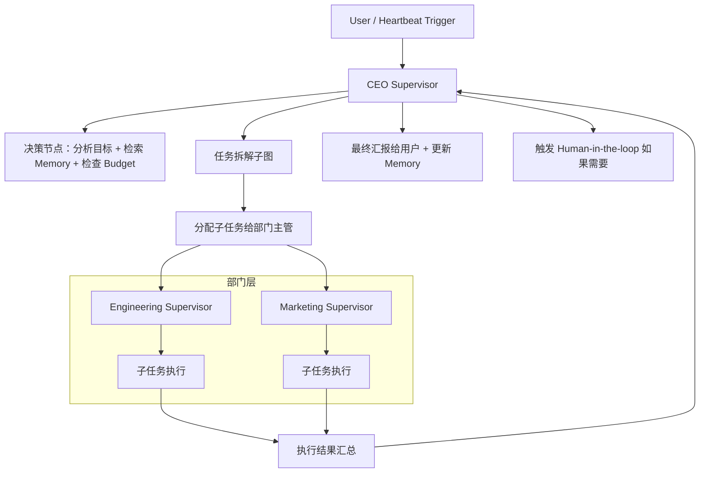

**LangGraph + Worker 自治运行整体设计**（Heartbeat + CEO Hierarchical Supervisor）

这是你 **AI 公司工厂** 项目中最核心的**智能引擎**部分。它将把之前所有模块（Organization、Agents、Skills、Collaboration、Memory、Tasks、Billing）有机串联起来，实现真正的 **“公司自动运行”** —— CEO 作为中枢，定期审查、主动决策、任务拆解、分配执行、汇总汇报，形成一个**分层多 Agent 自治系统**。

### 1. 整体架构定位与目标

**核心理念**：
- **CEO 是监督器（Supervisor）**，不是简单执行者。
- **分层架构**：CEO（顶层） → 部门主管（中层 Supervisor） → 普通员工 Agent（执行层）。
- **Heartbeat 驱动**：公司不是被动等待指令，而是像真实公司一样有“心跳”，定期主动审查和推进工作。
- **Human-in-the-loop**：重要决策始终保留用户最终审批权（可控但自治）。

**目标**：
- 用户下达一个大目标后，系统能自主拆解、执行、汇报。
- 公司能**主动发现问题、提出建议**（如“预算超支建议调整”）。
- 整个系统稳定、可观测、可审计。

### 2. 核心组件设计

#### 2.1 LangGraph Hierarchical Supervisor 结构（libs/ai）

推荐采用 **LangGraph.js** 实现分层监督架构：

**关键节点**：
- **CEO Supervisor**：最高层决策者
  - 输入：公司当前状态（Memory 检索）、待办任务、预算情况、Heartbeat 信号
  - 输出：拆解后的子任务树 + 分配建议 + 风险评估
  - 可配置性格（保守/激进/创新）影响决策风格

- **部门主管 Supervisor**（可选中层）：
  - 负责本部门任务进一步拆解和协调
  - 可并行执行，提高效率

- **执行 Agent**：
  - 具体执行节点，使用绑定的 Skills + Memory RAG

#### 2.2 Worker 中的自治运行机制（Heartbeat）

**HeartbeatService**（核心调度器）：
- **触发频率**：可配置（每小时 / 每天 / 每30分钟）
- **每次 Heartbeat 执行流程**：
  1. 检索公司当前 Memory（最近决策、未完成任务、预算状态）
  2. 调用 CEO Supervisor 进行审查
  3. 生成/更新待办任务列表
  4. 分配或重新分配任务
  5. 如果有高优先级或风险事项，触发 Human-in-the-loop
  6. 生成总结报告，推送到主群聊
  7. 更新 Billing 和 Audit

**事件驱动补充**：
- 除了定时 Heartbeat，还响应关键事件：
  - `task.completed`、`budget.warning`、`agent.need_approval` 等

### 3. 与现有模块的深度集成设计

| 模块                  | 如何集成到自治运行                                      | 具体作用 |
|-----------------------|-------------------------------------------------------|---------|
| **OrganizationModule** | CEO 拆解时参考当前组织结构                             | 决定把任务分配给哪个部门/节点 |
| **AgentsModule**      | 所有执行节点都是具体 Agent；CEO 使用 Agent 配置（性格、模型偏好） | 执行主体 + 模型路由 |
| **SkillsModule**      | 执行节点动态加载 Agent 绑定的 Skills                   | 实际行动能力 |
| **MemoryModule**      | 每一步都先 RAG 检索相关记忆；执行结果写入记忆         | 避免重复劳动 + 持续学习 |
| **CollaborationModule** | 所有决策、汇报、审批都在群聊中实时体现                 | 人机交互主通道 |
| **TasksModule**       | LangGraph 生成的任务树直接写入 TasksModule             | 进度追踪与仪表盘基础 |
| **BillingModule**     | 每一次 LLM 调用、Skill 调用都实时记账；预算影响路由决策 | 成本控制与预警 |

### 4. 关键技术实现建议

- **LangGraph 配置**：
  - 使用 `StateGraph` + `Supervisor` 模式实现分层。
  - 每个 Supervisor 有自己的 State（包含 Memory 检索结果、预算状态）。
  - 支持条件边（Conditional Edges）：根据预算或风险决定是否 Human-in-the-loop。

- **Worker 增强**：
  - 新增 `AutonomousOrchestratorService`
  - Heartbeat 使用 NestJS `@Cron()` 或基于 MQ 的定时事件
  - 所有长耗时操作（拆解、执行）都异步，避免阻塞

- **状态持久化**：
  - LangGraph Checkpoint 使用 PostgreSQL（或 Redis）
  - 公司状态快照定期保存，便于断点续跑

- **Human-in-the-loop 实现**：
  - Agent 发出 `agent.need_approval` 事件 → WebSocket 推送到用户群聊
  - 用户回复特定格式消息 → 系统继续执行

### 5. 实施路线图建议（分阶段）

**阶段 1：基础 Heartbeat + CEO Supervisor**
- 实现定时审查 + 简单任务拆解 + 汇报到群聊

**阶段 2：分层执行**
- 加入部门主管 Supervisor + 并行子任务执行

**阶段 3：完整闭环**
- Memory RAG 深度集成 + Budget 检查 + Human-in-the-loop

**阶段 4：生产优化**
- 性能调优、失败重试策略、详细审计、可观测性

### 6. 潜在风险与应对

- **风险**：LangGraph 状态爆炸（长任务上下文过长）
  - **应对**：结合 MemoryModule 定期总结 + 分段执行

- **风险**：Heartbeat 过于频繁导致成本失控
  - **应对**：预算检查前置 + 动态调整频率

- **风险**：多 Agent 协作时的协调冲突
  - **应对**：CEO Supervisor 作为最终仲裁者

- **风险**：调试困难
  - **应对**：完善 Tracing + 详细执行日志 + LangGraph 可视化工具

---

**总结评价**：

这个 LangGraph + Worker 自治运行设计，是你整个项目从“工具集合”升级为“智能 AI 公司”的**质变点**。它充分利用了你已有的坚实基础（Tenant → Tasks → Memory → Skills 等），形成了完整的 **感知（Memory + Collaboration）→ 决策（CEO Supervisor）→ 执行（Agents + Skills）→ 反馈（Billing + Dashboard）** 闭环。

做完这一部分后，用户就能真正体验到：
> “我只当老板，下达战略，AI 公司自己跑起来，而且越跑越聪明。”

---

**下一步建议**：

我可以立即为你提供以下任一项：

1. **LangGraph CEO Supervisor 的具体 Graph 代码结构与状态定义**（最推荐先做）
2. **HeartbeatService 的完整 NestJS 实现框架**
3. **整个自治运行系统的验收清单**
4. **项目最终收尾模块设计**（TemplatesModule + Platform Admin + 定价系统）

请告诉我你的优先选择，我会立刻给出详细内容（包含 Mermaid 图、关键代码结构建议等）。

你准备好进入这个最激动人心的部分了吗？🚀