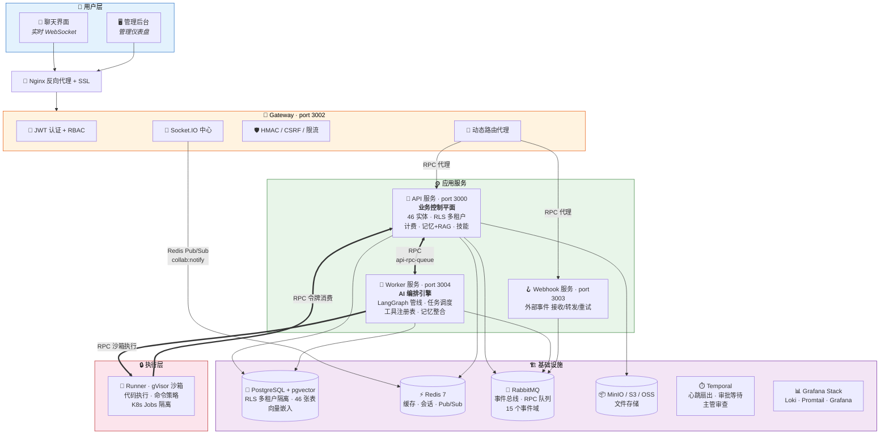
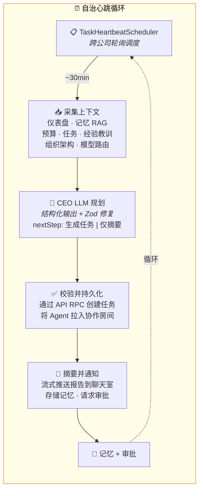
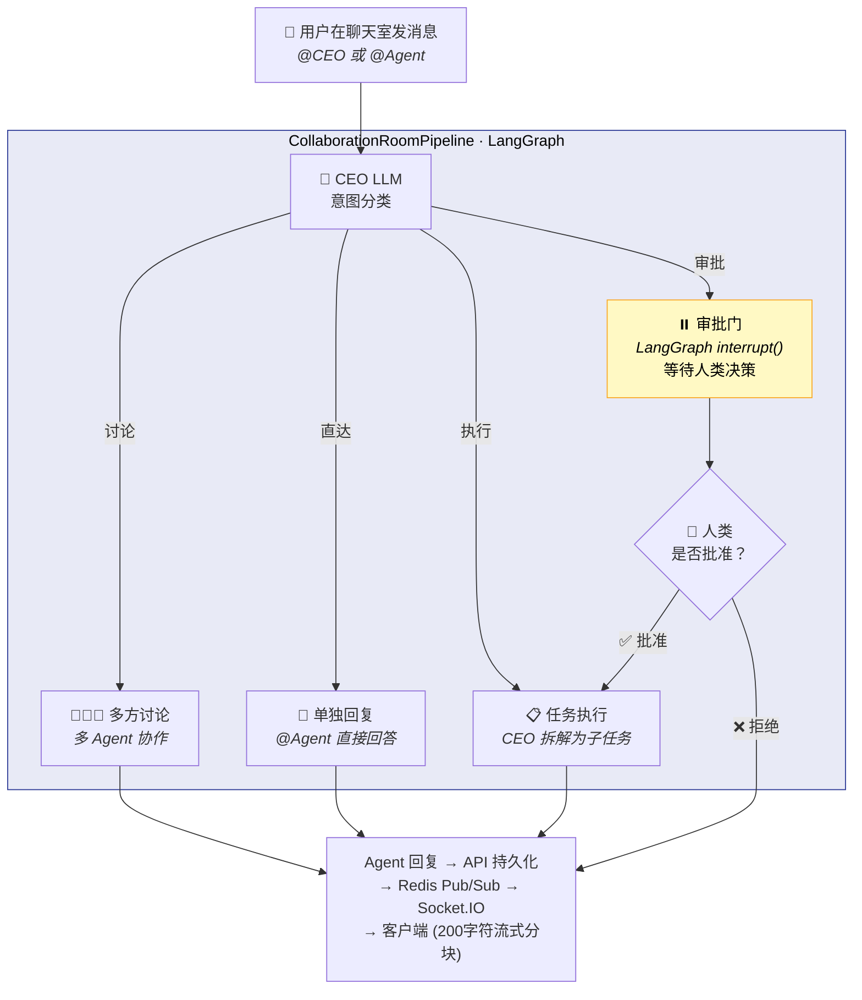
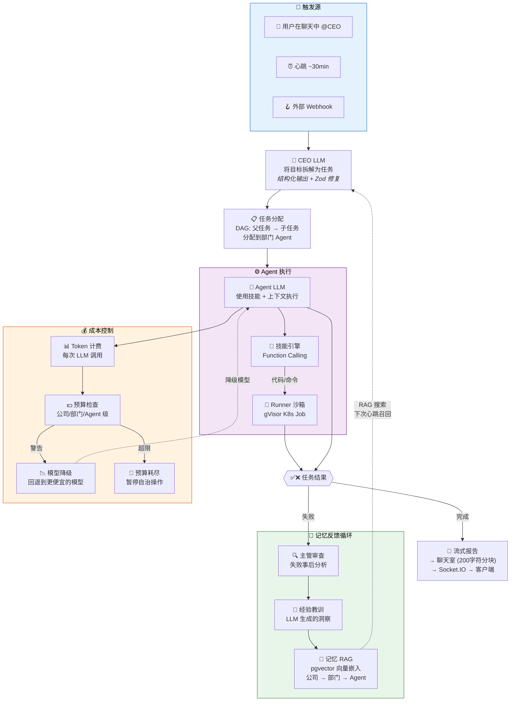

<p align="center">
  
</p>

<h1 align="center">Foundry</h1>

<p align="center">
  <strong>开源 AI 数字公司平台 — 让 AI 像真实团队一样协作</strong>
</p>

<p align="center">
  <a href="README.md">🇺🇸 English</a> |
  <a href="https://www.axislab.top">🖥️ 在线演示</a> |
  <a href="#-快速开始">快速开始</a> |
  <a href="#-核心功能">核心功能</a> |
  <a href="#-架构概览">架构</a> |
  <a href="#-与竞品对比">竞品对比</a> |
  <a href="docs/ARCHITECTURE.md">文档</a> |
  <a href="#-贡献">贡献</a>
</p>

<p align="center">
  <a href="https://github.com/axislab-top/Foundry/blob/main/LICENSE"></a>
  <a href="https://github.com/axislab-top/Foundry/stargazers"></a>
  <a href="https://github.com/axislab-top/Foundry/network/members"></a>
  <a href="https://github.com/axislab-top/Foundry/issues"></a>
  
  
  
  
</p>

---

## 🏭 这是什么？

Foundry 是一套**开源的 AI 驱动数字公司平台**。不同于 Agent 框架（你需要自己编排），Foundry 提供**开箱即用的 AI 公司** — 你只需输入战略目标，AI 公司就能自主运行。

> 💡 **一句话理解**：如果 CrewAI 是"搭积木的框架"，Foundry 就是"已经搭好的公司"。

**典型场景**：你在群聊中说 "分析竞品并出一份报告"，CEO Agent 自动拆解任务、分配给分析部门、并行执行、汇总结果，全程你只需审批关键节点。

### 📸 产品预览

| 注册页 | 组织架构 |
|:---:|:---:|
|  |  |

| 群聊协作 | 管理后台 |
|:---:|:---:|
|  |  |

---

## 🚀 快速开始

### 系统要求

| 要求 | 最低配置 | 推荐配置 |
|------|---------|---------|
| **操作系统** | Windows 10+、macOS 12+、Ubuntu 20.04+ | 任意 64 位系统 |
| **CPU** | 2 核 | 4 核以上 |
| **内存** | 8 GB | 16 GB |
| **磁盘** | 5 GB 可用空间 | 10 GB 以上 |
| **Docker** | 20.10+ | 最新稳定版 |
| **Node.js** | 20+ | 22 LTS |
| **pnpm** | 10+ | 最新版 |

> 💡 **磁盘占用说明**：项目约 1.5 GB + Docker 镜像约 1 GB + 构建缓存约 1 GB。建议使用 SSD 以加快 Docker 启动速度。

### 内置基础设施（无需单独安装）

所有基础设施通过 Docker 运行，**不需要单独安装**：

| 服务 | 用途 | Docker 镜像 |
|------|------|------------|
| PostgreSQL 18 | 主数据库 | `postgres:18-alpine` |
| Redis 7 | 缓存与会话 | `redis:7-alpine` |
| RabbitMQ 3 | 消息队列 | `rabbitmq:3-management` |
| Consul | 服务发现 | `consul:latest` |
| Nginx | 反向代理 | `nginx:alpine` |

### 一键启动（推荐）

```bash
git clone https://github.com/axislab-top/Foundry.git && cd Foundry
pnpm setup:dev   # 配置环境 → 安装依赖 → 启动服务 → 初始化数据库
```

### 或者分步执行

```bash
# 1. 克隆仓库
git clone https://github.com/axislab-top/Foundry.git && cd Foundry

# 2. 安装依赖
pnpm install

# 3. 配置环境变量（可选 — 本地开发用默认值即可）
cp env.shared.example .env.shared

# 4. 启动所有服务（基础设施 + 应用）
pnpm start:dev:local

# 5. 初始化数据库（建表 + 种子数据）
pnpm migrate:run
```

> ⏱️ **首次启动需要 5-10 分钟** — Docker 需要下载所有镜像（约 2 GB）。后续启动约 30 秒。

> 💡 **Windows 用户**：如遇权限问题，请以管理员身份运行。

容器健康且迁移完成后，访问：

| 服务 | 地址 | 说明 |
|------|------|------|
| 🖥️ 用户端 | http://localhost:5173 | 主界面（Vite 开发服务器） |
| 🔧 管理后台 | http://localhost:3105 | 管理员仪表盘 |
| 📡 API 服务 | http://localhost:3000/api-docs | API Swagger 文档 |
| 📡 网关服务 | http://localhost:3002/api-docs | 网关 Swagger 文档 |
| 📊 Grafana | http://localhost:4000 | 日志可视化（admin/admin） |
| 🐰 RabbitMQ | http://localhost:15672 | 消息队列管理（guest/guest） |

### 默认管理员账号

管理员账号在首次启动时**自动创建**：

| 字段 | 值 |
|------|-----|
| 邮箱 | `admin@example.com` |
| 用户名 | `admin` |
| 密码 | `changeme` |

> ⚠️ 生产环境必须修改 `DEFAULT_ADMIN_PASSWORD` 环境变量。

### 常用命令

```bash
pnpm infra:status    # 查看容器状态
pnpm infra:logs      # 查看容器日志
pnpm infra:stop      # 停止所有容器
pnpm infra:restart   # 重启所有容器
```

### 常见问题

| 问题 | 解决方案 |
|------|---------|
| 端口被占用 | 先运行 `pnpm infra:stop`，或修改 `env.shared.example` 中的端口 |
| Docker 未运行 | 启动 Docker Desktop 并等待就绪 |
| 内存不足 | 在 Docker Desktop 设置中将内存限制提高到 8 GB 以上 |
| Windows 下运行慢 | 启用 Docker Desktop 的 WSL 2 后端 |
| `getaddrinfo ENOTFOUND postgres` | 有残留的 `.env` 文件使用了 Docker 主机名。删除 `.env` 后重新运行 `pnpm setup:dev` |
| RabbitMQ `ACCESS_REFUSED` | RabbitMQ 容器凭据不正确。运行 `pnpm infra:stop` 后重新 `pnpm setup:dev` |
| 数据库连接超时 | Windows 下 PostgreSQL 启动较慢，应用会自动重试（10秒超时） |

> 💡 **诊断数据库问题**：项目运行时在另一个终端执行 `node scripts/diagnose-db.js`

### 首次使用

完成上述步骤后：

```bash
# 1. 登录管理后台 http://localhost:3105
#    邮箱: admin@example.com  密码: changeme

# 2. 配置 LLM Key（AI Agent 运行必需）：
#    管理后台 → LLM Keys → 添加你的 OpenAI/Claude API Key

# 3. 打开用户端 http://localhost:5173
#    注册新账号或登录，开始使用平台
```

### 需要你配置的内容

| 配置项 | 配置位置 | 说明 |
|--------|---------|------|
| LLM API Key | 管理后台 → LLM Keys | AI Agent 运行必需 |
| 公司信息 | 管理后台 → 公司 | 公司名称和行业 |
| Agent 技能 | 管理后台 → 技能 | 启用/禁用和配置技能 |
| 邮件设置 | 管理后台 → 设置 | 用于通知（可选） |

> 💡 **提示**：登录管理后台后，先去 **LLM Keys** 添加至少一个 API Key（OpenAI、Claude 等），否则 AI Agent 无法工作。

---

## ✨ 核心功能

<details>
<summary><strong>🏗️ 一键创建公司</strong> — 输入名称和行业，自动生成组织架构</summary>

- 自动生成 董事会 → CEO → 部门主管 → 员工 Agent 的完整架构
- 内置行业模板，一键初始化公司配置
- 支持拖拽自定义组织架构
</details>

<details>
<summary><strong>🤖 多 Agent 协作</strong> — 各司其职，像真实团队一样工作</summary>

- CEO Agent 负责战略拆解和任务分配
- 部门主管 Agent 负责子任务编排
- 员工 Agent 负责具体执行（调用 Skills、API、代码执行）
- 支持自定义 Agent 角色和能力
</details>

<details>
<summary><strong>💬 实时群聊协作</strong> — 不只是对话，是真正的协作</summary>

- 动态群聊 + 流式输出 + @提及
- Human-in-the-loop 审批流（关键决策需要你确认）
- 任务进度实时推送
- 支持多公司、多群聊并行
</details>

<details>
<summary><strong>🧠 分层记忆系统</strong> — AI 公司会"学习"</summary>

- 公司级 / 部门级 / Agent 级三层记忆
- RAG 智能检索（基于 pgvector）
- 记忆自动沉淀和衰减
- 跨会话上下文保持
</details>

<details>
<summary><strong>🔄 自治运行</strong> — 不需要你盯着</summary>

- CEO Agent 定期 Heartbeat 审查待办
- 任务自动拆解 → 分配 → 执行 → 汇报
- Temporal 工作流引擎保障可靠性
- 支持定时任务和事件驱动
</details>

<details>
<summary><strong>💰 成本与治理</strong> — 每一分钱都清楚</summary>

- 实时 Token 消耗和费用统计
- 公司级预算控制
- 模型智能路由（自动选择性价比最优的模型）
- 完整审计日志
- LLM Key 池管理（多 Key 轮询）
</details>

---

## 🏗️ 架构概览

### 系统总览



### 核心差异：自治心跳循环

> CEO Agent 运行在 **约 30 分钟的自治循环** 上 — 无需人类提示。每轮从 7 个来源采集上下文，通过 LLM 规划，创建任务，并将报告流式推送到聊天室。



### 核心差异：协作管线

> 用户消息触发一个 **LangGraph 状态机**，包含 4 条意图路径和一个 **人机协作审批门**（interrupt/resume）。



### 端到端核心链路

> 完整生命周期：从用户目标到 Agent 执行、成本追踪、失败审查、记忆回流 — 形成一个**自我改进的闭环**。



> 📄 完整架构文档 → [docs/ARCHITECTURE.md](docs/ARCHITECTURE.md)

---

## 🆚 与竞品对比

| 特性 | Foundry | CrewAI | MetaGPT | ChatDev | AutoGen |
|------|---------|--------|---------|---------|---------|
| **定位** | AI 数字公司平台 | Agent 编排框架 | AI 软件公司 | 零代码开发平台 | Agent 编程框架 |
| **开箱即用** | ✅ 完整平台 | ❌ 需编排 | ⚠️ 仅代码生成 | ⚠️ 仅代码生成 | ❌ 需编程 |
| **实时群聊** | ✅ WebSocket | ❌ | ❌ | ❌ | ❌ |
| **组织架构可视化** | ✅ 拖拽编辑 | ❌ | ⚠️ 固定角色 | ⚠️ 固定角色 | ❌ |
| **分层记忆** | ✅ 3 层 + RAG | ❌ | ❌ | ❌ | ❌ |
| **成本控制** | ✅ 预算+路由 | ❌ | ❌ | ❌ | ❌ |
| **多租户** | ✅ RLS 隔离 | ❌ | ❌ | ❌ | ❌ |
| **审批流** | ✅ Human-in-loop | ❌ | ❌ | ❌ | ❌ |
| **管理后台** | ✅ 独立前端 | ❌ | ❌ | ❌ | ✅ Studio |
| **技术栈** | NestJS + React | Python | Python | Python | Python + .NET |
| **许可证** | GPL-3.0 | MIT | MIT | Apache-2.0 | MIT |

> 💡 **核心差异**：竞品是"框架"，你需要写代码编排 Agent。Foundry 是"平台"，注册就能用 — 就像 Slack 和 IRC 的区别。

---

## 🛠️ 技术栈

| 层级 | 技术 |
|------|------|
| 后端 | NestJS (TypeScript) · 7 个微服务 |
| 前端 | React 18 · Vite · TypeScript |
| 构建 | pnpm workspace · Turborepo |
| 数据库 | PostgreSQL (TypeORM + RLS 多租户) · pgvector |
| 消息队列 | RabbitMQ |
| 缓存 | Redis |
| AI 编排 | LangChain · LangGraph |
| 实时通信 | Socket.IO (WebSocket) |
| 对象存储 | MinIO / S3 / OSS / 本地存储 |
| 工作流 | Temporal (可选) |
| 容器化 | Docker Compose |

---

## 📁 项目结构

```
Foundry/
├── apps/                    # 微服务
│   ├── api/                 #   API 服务（核心业务）
│   ├── gateway/             #   网关（认证、限流、路由）
│   ├── worker/              #   后台任务
│   ├── webhooks/            #   Webhook 处理
│   ├── runner/              #   代码执行沙箱
│   ├── temporal-worker/     #   Temporal 工作流
│   └── logging/             #   日志服务
├── admin-system/            # 管理后台前端
├── client-frontend/         # 用户端前端
├── packages/                # 共享包 (messaging, security, tenant...)
├── infrastructure/          # 基础设施配置
├── contracts/               # 事件契约 & OpenAPI
├── deployment/              # Docker Compose 部署
└── docs/                    # 文档
```

---

## ⚙️ 环境变量

核心配置在 [`env.shared.example`](env.shared.example) 中有完整说明。关键变量：

```bash
# 🔴 必须修改（生产环境）
JWT_SECRET=<openssl rand -base64 32>
DB_PASSWORD=<强密码>
DEFAULT_ADMIN_PASSWORD=<强密码>

# 🟡 可选配置
TEST_AUTH_ENABLED=false          # 测试用户注入（仅开发）
FILE_UPLOAD_MAX_SIZE=52428800    # 文件上传限制 50MB
KIBANA_ENCRYPTION_KEY=<密钥>     # Kibana（如使用 ELK）
```

---

## ❓ FAQ

<details>
<summary><strong>Q: Foundry 和 CrewAI/AutoGen 有什么区别？</strong></summary>

CrewAI/AutoGen 是 **Agent 编排框架** — 你需要写 Python 代码来定义 Agent、设置工具、编排流程。

Foundry 是 **AI 数字公司平台** — 你注册账号、创建公司，AI 就自动运行了。不需要写代码。

类比：CrewAI 像买零件自己组装电脑，Foundry 像买整机直接用。
</details>

<details>
<summary><strong>Q: 支持哪些 AI 模型？</strong></summary>

通过 LLM Key 池管理，支持所有主流模型：OpenAI、Anthropic Claude、Azure OpenAI、国内模型（通义千问、文心一言等）。支持多 Key 轮询和智能路由。
</details>

<details>
<summary><strong>Q: 可以商用吗？</strong></summary>

可以。本项目基于 GPL-3.0 许可证开源。商用需要遵守 GPL-3.0 条款（衍生作品也需要开源）。如果你需要商业授权，请联系我们。
</details>

<details>
<summary><strong>Q: 数据安全如何保障？</strong></summary>

- 多租户 RLS（行级安全）隔离
- LLM Key 加密存储（AES-256-GCM）
- JWT + RBAC 权限控制
- 完整审计日志
- 所有凭证通过环境变量管理，不硬编码
</details>

<details>
<summary><strong>Q: 最低硬件要求？</strong></summary>

- 开发环境：4GB RAM + 2 CPU（Docker）
- 生产环境：8GB RAM + 4 CPU（推荐）
- 存储：PostgreSQL + Redis + RabbitMQ + MinIO
</details>

---

## 🤝 贡献

我们欢迎所有形式的贡献！

| 类型 | 说明 |
|------|------|
| 🐛 Bug 报告 | [提交 Issue](https://github.com/axislab-top/Foundry/issues/new?template=bug_report.yml) |
| 💡 功能建议 | [提交 Issue](https://github.com/axislab-top/Foundry/issues/new?template=feature_request.yml) |
| 📝 文档改进 | 直接提交 PR |
| 🔧 代码贡献 | Fork → Branch → PR |

详见 [CONTRIBUTING.md](CONTRIBUTING.md)

### 贡献者

<a href="https://github.com/axislab-top/Foundry/graphs/contributors">
  
</a>

---

## 📜 许可证

本项目基于 [GPL-3.0](LICENSE) 许可证开源。

---

## ⭐ Star History

[](https://star-history.com/#axislab-top/Foundry&Date)

---

<p align="center">
  如果觉得有用，请给个 ⭐ Star 支持一下！<br>
  <a href="https://github.com/axislab-top/Foundry/stargazers">⭐ 给个 Star</a> •
  <a href="https://github.com/axislab-top/Foundry/fork">🍴 Fork 一下</a> •
  <a href="https://github.com/axislab-top/Foundry/issues/new?template=bug_report.yml">🐛 报告 Bug</a>
</p>
