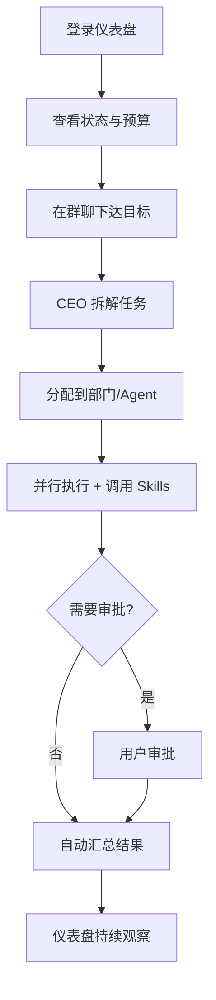
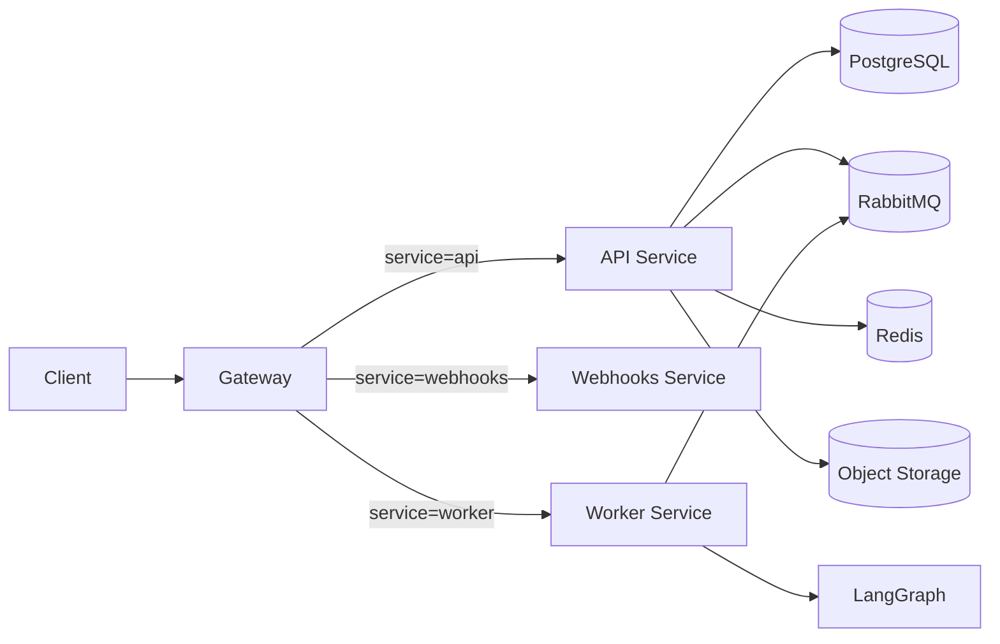

# Foundry 架构与功能概览

## 1. 项目简介

**Foundry** 是一套开源的 AI 驱动数字公司平台。用户可以像创建 Slack Workspace 一样一键创建 AI 公司，每个公司拥有完整的组织架构（董事会 → CEO → 部门 → 员工 Agent）、实时群聊、记忆系统、任务自治执行和成本控制能力。

用户只需下达战略目标，AI 公司就能自主运行、主动建议、持续学习。

### 核心能力

| 能力 | 说明 |
|------|------|
| 一键创建公司 | 输入名称和行业，自动生成组织架构、CEO、初始预算 |
| 组织架构可视化 | 董事会 → CEO → 部门主管 → 员工 Agent，支持拖拽自定义 |
| 实时群聊协作 | 动态群聊 + 流式输出 + @提及 + Human-in-the-loop 审批 |
| 自治运行 | CEO Agent 定期 Heartbeat 审查待办、拆解任务、分配执行 |
| 分层记忆系统 | 公司/部门/Agent 级记忆 + RAG 智能检索 |
| 成本与治理 | 实时费用透明 + 预算控制 + 模型智能路由 + 审计日志 |

### 典型使用流程



---

## 2. 技术栈

| 层级 | 技术 |
|------|------|
| 后端框架 | NestJS (TypeScript) |
| 前端框架 | React + Vite |
| 构建编排 | pnpm workspace + Turborepo |
| 数据库 | PostgreSQL (TypeORM + 迁移 + RLS 多租户隔离) |
| 消息队列 | RabbitMQ (抽象层 `@service/messaging`) |
| AI 编排 | LangChain + LangGraph |
| 实时通信 | Socket.IO (WebSocket) |
| 缓存 | Redis |
| 对象存储 | MinIO / S / OSS / 本地文件系统 |
| 可观测性 | OpenTelemetry + Prometheus + Grafana |
| 测试 | Jest + Cypress + Pact (契约测试) |

---

## 3. 服务架构



### 服务职责

| 服务 | 路径 | 职责 |
|------|------|------|
| **Gateway** | `apps/gateway` | 统一入口、动态路由转发、JWT 鉴权、限流、安全中间件、审计、WebSocket |
| **API** | `apps/api` | 业务控制面：用户、公司、组织、Agent、技能、协作、记忆、任务、计费、模板 |
| **Worker** | `apps/worker` | 事件消费、LangGraph 自治编排、任务心跳、计费处理 |
| **Webhooks** | `apps/webhooks` | Webhook 配置 CRUD、接收外部事件、带重试的转发 |
| **Temporal Worker** | `apps/temporal-worker` | Temporal 工作流（公司心跳扇出等） |
| **Logging** | `apps/logging` | 独立日志服务（接收、脱敏、存储、查询） |

### 共享基础设施包

| 包 | 职责 |
|----|------|
| `@service/messaging` | 消息队列抽象层 |
| `@service/tenant` | 多租户上下文解析 |
| `@service/security` | 加密、签名、CSRF |
| `@service/cache` | Redis 缓存抽象 |
| `@service/config` | 配置管理 |
| `@service/storage` | 对象存储抽象 |
| `contracts/events` | 跨服务事件契约 |
| `contracts/types` | 共享类型定义 |

---

## 4. 核心模块

### 4.1 多租户与数据隔离

- 请求上下文解析公司与租户信息
- **TypeORM + Postgres RLS** 在会话级设置租户隔离
- 不同公司数据永不交叉

### 4.2 用户与认证

- 用户注册、登录、JWT 刷新、登出
- 微信 OAuth 授权
- 网关全局 `JwtAuthGuard`

### 4.3 公司与组织

- **公司**：创建、查询、状态管理（激活/暂停/归档）
- **组织架构**：树形结构（董事会 → CEO → 部门 → Agent），支持拖拽调整
- 变更审计：每次结构调整记录快照

### 4.4 Agent 与技能

- **Agent**：AI 数字员工，支持自定义角色、System Prompt、LLM 模型
- **技能（Skills）**：平台/组织技能管理，支持外部 API 集成
- **Agent 商城**：购买/订阅专业 Agent 与 Skills 包

### 4.5 实时协作

- **群聊**：默认主群（用户 + CEO），支持动态拉部门/Agent
- **WebSocket**：Socket.IO `/collaboration` 命名空间
- **Human-in-the-loop**：Agent 主动请求审批，用户在群聊中直接回复

### 4.6 记忆系统

- **分层记忆**：公司级 / 部门级 / Agent 级
- **RAG 检索**：Agent 执行时自动检索最相关记忆注入 Prompt
- **自动知识提炼**：对话和任务结束后自动总结并向量化存储

### 4.7 任务与自治执行

- **任务管理**：DAG 依赖关系、执行日志、运行记录
- **Heartbeat 机制**：CEO 定期审查待办、拆解任务、分配执行
- **LangGraph 编排**：`ingest → plan → validate → summarize → notify` 节点链

### 4.8 计费与预算

- 实时费用追踪（每个 Agent / 任务 / Skill 单独计费）
- 公司 / 部门 / Agent 级预算上限
- 超支自动暂停或降级模型

### 4.9 模板市场

- 官方 + 社区模板，一键导入完整公司（组织 + Agent + Skills + 示例任务）
- 导入后幂等物化

### 4.10 文件存储

- 上传、下载、预签名 URL
- 适配器切换：MinIO / S3 / OSS / 本地文件系统

---

## 5. 安全机制

网关实现多层安全中间件（条件生效，兼容纯 JWT 调用）：

| 中间件 | 功能 | 运行条件 |
|--------|------|----------|
| **SignatureMiddleware** | HMAC 签名校验 | 携带签名相关 Header 时生效 |
| **ReplayAttackMiddleware** | 时间戳 + nonce 防重放 | 携带 `x-timestamp` / `x-nonce` 时生效 |
| **CsrfProtectionMiddleware** | CSRF 防护 | `CSRF_ENABLED=true` 且携带 `x-csrf-token` 时生效 |
| **IpFilterMiddleware** | IP 黑白名单 | 命中规则时拦截 |

---

## 6. 可观测性

| 维度 | 实现 |
|------|------|
| 健康检查 | 各服务暴露 `/api/health` |
| 指标 | Prometheus 文本格式（`/api/metrics`） |
| 审计日志 | 网关审计拦截器 + 审计实体 |
| 链路追踪 | OpenTelemetry + ClickHouse trace_events |
| 日志 | 独立日志服务 + 脱敏处理 |

---

## 7. 快速开始

### 环境要求

- Node.js >= 20
- pnpm >= 9
- Docker & Docker Compose（推荐，用于启动 PostgreSQL、Redis、RabbitMQ）

### 一键启动（推荐）

```bash
# 1. 克隆仓库
git clone https://github.com/your-org/foundry.git
cd foundry

# 2. 安装依赖
pnpm install

# 3. 复制环境变量模板
cp env.shared.example .env.shared

# 4. 启动基础设施（PostgreSQL + Redis + RabbitMQ）
docker compose -f deployment/docker/docker-compose.yml up -d postgres redis rabbitmq

# 5. 运行数据库迁移
pnpm --filter @service/api run migration:run

# 6. 启动所有服务
pnpm dev
```

启动后访问：
- API 服务：`http://localhost:3000/api/health`
- 网关：`http://localhost:3002/api/health`
- 管理后台：`http://localhost:5173`

### 环境变量

所有配置通过环境变量管理。复制 `env.shared.example` 为 `.env.shared` 并根据注释修改：

| 变量 | 说明 | 必须修改？ |
|------|------|-----------|
| `JWT_SECRET` | JWT 签名密钥 | ⚠️ 生产环境必须修改 |
| `DB_PASSWORD` | 数据库密码 | 开发可保持默认 |
| `RABBITMQ_PASSWORD` | RabbitMQ 密码 | 开发可保持默认 |
| `AES_KEY` | 数据加密密钥 | ⚠️ 生产环境必须修改 |
| `DEFAULT_ADMIN_PASSWORD` | 默认管理员密码 | ⚠️ 生产环境必须修改 |

> ⚠️ **开发环境**可直接使用默认值启动。**生产环境**必须设置所有带 `⚠️` 标记的变量，否则服务会拒绝启动。

---

## 8. 项目结构

```
├── apps/
│   ├── api/              # 业务 API 服务
│   ├── gateway/          # API 网关
│   ├── worker/           # 后台任务处理
│   ├── webhooks/         # Webhook 服务
│   ├── temporal-worker/  # Temporal 工作流
│   ├── logging/          # 日志服务
│   └── runner/           # 代码执行器
├── client-frontend/      # 用户端前端
├── admin-system/         # 管理端前端
├── packages/core/        # 核心共享包
├── contracts/            # 事件契约与类型
├── infrastructure/       # 基础设施包
│   ├── postgres/         # 数据库迁移
│   ├── messaging/        # 消息队列
│   ├── security/         # 加密与安全
│   ├── cache/            # Redis 缓存
│   ├── tenant/           # 多租户
│   ├── ai/               # LangGraph 编排
│   ├── storage/          # 对象存储
│   └── migrations/       # TypeORM 迁移工具
├── deployment/           # 部署配置
├── scripts/              # 工具脚本
└── test/                 # 测试
```

---

## 9. 许可证

本项目采用 [GPL-3.0](https://www.gnu.org/licenses/gpl-3.0.html) 许可证。
