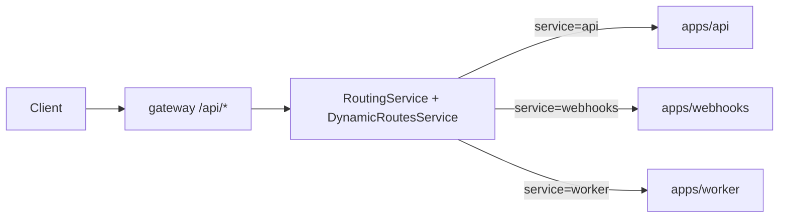
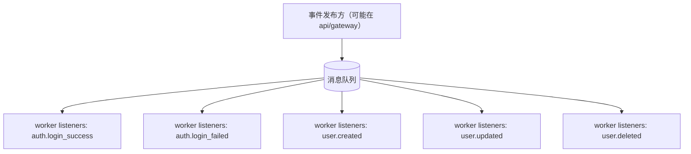

# Foundry 微服务架构总览（端到端链路 + 安全运行条件）

本文档面向“如何理解与如何验收”两类需求：用最少的阅读成本说明服务职责、交互链路、以及关键安全中间件在何种条件下生效。

---

## 1. 服务职责（apps/*）

- `apps/gateway`
  - 统一入口：捕获所有请求，动态匹配路由并把请求代理到下游服务（`api` / `webhooks` / `worker`）
  - 统一鉴权与治理：JWT 全局守卫、限流（部分路由）、审计拦截器、指标导出、断路器（可选）
  - 安全中间件链路：签名校验、防重放、CSRF、IP 黑白名单

- `apps/api`
  - 业务 API：文件存储（minio/s3/oss/local 适配器）、用户、认证校验、OAuth 绑定等
  - 运行基础设施：全局前缀 `/api`、请求参数校验、拦截器链、请求日志与请求 ID

- `apps/webhooks`
  - Webhook 管理与接收：配置 CRUD、接收外部事件 `POST /api/webhooks/receive`
  - 异步处理与转发：对每个事件记录历史（pending/success/failed）并带重试转发

- `apps/worker`
  - 消息消费者：订阅并处理 `contracts/events` 定义的业务事件（登录成功/失败、用户创建/更新/删除）
  - Listener 内部已提供可运行的最小处理逻辑（结构化日志/告警），保证端到端可验收

- `apps/logging`
  - 独立日志服务：`POST /api/logs`（支持批量）、`GET /api/logs`、`GET /api/logs/:id`
  - 处理链路：接收解析 -> 脱敏处理 -> 存储（Elasticsearch/Loki/文件/控制台）-> 查询（内存为主）

---

## 2. 端到端请求链路（HTTP）

网关的关键点：

- `ProxyController` 使用 `@All('*')` 捕获请求，交由 `RoutingService.route(method, path, req)`
- `RoutingService` 先从动态路由表找匹配项，找不到再退回静态路由配置
- 根据路由 `service` 代理到对应下游，并可能执行 `rewritePath`

---

## 3. 端到端事件链路（消息）

说明：

- `apps/worker` 在 `onModuleInit()` 中通过 `MessagingService.subscribe(...)` 完成队列订阅
- Listener 的业务动作目前部分以 `TODO` 标记，但“接收事件并分发处理”的链路已存在

---

## 4. 安全中间件运行条件（gateway）

### 4.1 为什么“条件校验”很关键？

你的网关同时存在 JWT 鉴权与“API Key 签名认证”两类潜在安全方式。如果签名/防重放/CSRF 无条件开启，会破坏现有 JWT 调用链路。

因此：本仓库已将安全中间件挂载到全路由链路，但对“未携带对应 header 的请求”自动跳过，以兼容现有 JWT 流程。

### 4.2 签名（HMAC）与防重放

- `SignatureMiddleware`
  - 若请求没有携带任意签名相关 header：`Signature` / `x-timestamp` / `x-nonce` / `x-api-secret`，则跳过
  - 若携带了签名相关 header，则必须携带 `Signature`、`x-timestamp`、`x-nonce`、`x-api-secret`，并进行 HMAC 校验
  - 签名校验成功后，网关会把 API Key 的 `permissions` 映射到后续鉴权所需的 `request.user.roles` / `request.user.permissions`

- `ReplayAttackMiddleware`
  - 若请求没有携带 `x-timestamp` 和 `x-nonce`，则跳过
  - 若携带了重放相关 header，则通过 `NonceService` 校验 nonce 是否已使用

### 4.3 CSRF

- `CsrfProtectionMiddleware`
  - 默认关闭（`CSRF_ENABLED === 'true'` 才会启用）
  - 启用后，仅当请求携带 `x-csrf-token` header 时才触发校验（减少对纯 API 调用的影响）

### 4.4 IP 黑白名单

- `IpFilterMiddleware`
  - 黑白名单规则由 `admin/ip-filter` 管理
  - 未命中规则时默认允许；命中黑名单时返回 `403`

---

## 5. 代码改动对应关系（本次已实现）

安全中间件已在网关链路中“真正挂载并可运行”：

- 挂载点：`apps/gateway/src/app.module.ts`（`MiddlewareConsumer.apply(...).forRoutes('*')`）
- rawBody 支持：`apps/gateway/src/main.ts`（`NestFactory.create(..., { rawBody: true })`）
- 签名/防重放/CSRF 的条件校验：
  - `apps/gateway/src/common/security/middleware/signature.middleware.ts`
  - `apps/gateway/src/common/security/middleware/replay-attack.middleware.ts`
  - `apps/gateway/src/common/security/middleware/csrf.middleware.ts`

---

## 6. 下一步建议（如果你要“真正生产可验收”）

为了让架构从“能跑”变为“可生产验收”，建议你优先确认以下闭环是否满足你期望：

1. **签名/防重放运行验收**：用带/不带签名 header 的两组请求分别验证 JWT 接口是否仍可调用，以及签名失败是否按预期拦截。
2. **worker 业务闭环验收**：确认事件发布方与监听方的契约一致（`contracts/events` 的事件 schema），以及监听器产生的结构化日志/告警是否符合预期（后续可接入 DB/邮件/告警系统）。
3. **日志与审计的查询一致性**：`apps/logging` 的查询目前偏内存；如果你需要生产级检索，请把查询后端统一到 Elasticsearch/Loki/DB。
