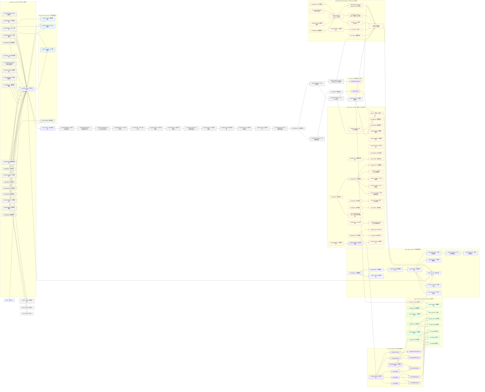

# Foundry 项目架构（端到端链路）

```mermaid
flowchart LR
  Client["Client（客户端）"] --> GWRT["Gateway runtime（网关运行时）"]

  %% ==================================================
  %% 网关：从入口到下游服务（modules + 中间件/守卫/拦截器）
  %% ==================================================
  subgraph GWMS["Gateway Nest modules（网关 Nest 模块）"]
    direction TB

    %% ConfigModule：配置模块（读取环境/配置并注入）
    Cfg["ConfigModule（配置模块）"]:::gw
    %% DatabaseModule：数据库模块（ORM/连接等）
    DB["DatabaseModule（数据库模块）"]:::gw
    %% CacheModule：缓存模块（如 Redis 等）
    Cache["CacheModule（缓存模块）"]:::gw
    %% SecurityModule：安全模块（鉴权相关组件聚合）
    Sec["SecurityModule（安全模块）"]:::gw
    %% ExceptionsModule：异常处理模块（统一错误封装）
    Ex["ExceptionsModule（异常模块）"]:::gw
    %% TracingModule：链路追踪模块（Trace/Span 相关）
    Trc["TracingModule（链路追踪模块）"]:::gw
    %% InterceptorsModule：拦截器模块（Interceptors）
    Int["InterceptorsModule（拦截器模块）"]:::gw
    %% MonitoringModule：监控模块（指标/探针等）
    Mon["MonitoringModule（监控模块）"]:::gw
    %% ResilienceModule：韧性模块（限流/熔断/降级等）
    Res["ResilienceModule（韧性模块）"]:::gw
    %% ServiceDiscoveryModule：服务发现模块
    SD["ServiceDiscoveryModule（服务发现模块）"]:::gw
    %% AuditModule：审计模块（审计日志/审计事件）
    AuditM["AuditModule（审计模块）"]:::gw
    %% HealthModule：健康检查模块
    HealthM["HealthModule（健康检查模块）"]:::gw
    %% AuthModule：认证模块（登录/鉴权支持）
    AuthM["AuthModule（认证模块）"]:::gw
    %% RoutingModule：路由模块（动态路由/转发规则）
    RoutingM["RoutingModule（路由模块）"]:::gw
    %% RpcModule：RPC 客户端模块（API/Webhooks ClientProxy）
    RpcM["RpcModule（RPC 客户端模块）"]:::gw
    %% ApiKeyModule：API Key 校验模块
    ApiKeyM["ApiKeyModule（API Key 模块）"]:::gw
    %% IpFilterModule：IP 白/黑名单过滤模块
    IpFilterM["IpFilterModule（IP 过滤模块）"]:::gw
    %% RateLimitingModule：限流模块
    RateM["RateLimitingModule（限流模块）"]:::gw
    %% CircuitBreakerModule：熔断器模块
    CircuitM["CircuitBreakerModule（熔断模块）"]:::gw

    %% 各模块聚合到 Gateway runtime
    Cfg --> GWRT
    DB --> GWRT
    Cache --> GWRT
    Sec --> GWRT
    Ex --> GWRT
    Trc --> GWRT
    Int --> GWRT
    Mon --> GWRT
    Res --> GWRT
    SD --> GWRT
    AuditM --> GWRT
    HealthM --> GWRT
    AuthM --> GWRT
    RoutingM --> GWRT
    RpcM --> GWRT
    ApiKeyM --> GWRT
    IpFilterM --> GWRT
    RateM --> GWRT
    CircuitM --> GWRT
  end

  %% =========================
  %% 网关请求链路
  %% =========================
  %% ProxyController：网关代理控制器（入口处理）
  GWRT --> Proxy["ProxyController（代理控制器）"]
  %% SignatureMiddleware：请求签名校验
  Proxy --> Sig["SignatureMiddleware（签名校验中间件）"]:::gw
  %% ReplayAttackMiddleware：防重放攻击
  Sig --> Nonce["ReplayAttackMiddleware（防重放中间件）"]:::gw
  %% CsrfProtectionMiddleware：CSRF 防护
  Nonce --> Csrf["CsrfProtectionMiddleware（CSRF 防护中间件）"]:::gw
  %% IpFilterMiddleware：IP 过滤
  Csrf --> IpF["IpFilterMiddleware（IP 过滤中间件）"]:::gw
  %% JwtAuthGuard：JWT 认证守卫
  IpF --> Jwt["JwtAuthGuard（JWT 认证守卫）"]:::gw
  %% LoggingInterceptor：日志拦截
  Jwt --> LogI["LoggingInterceptor（日志拦截器）"]:::gw
  %% TimeoutInterceptor：超时控制
  LogI --> TimeoutI["TimeoutInterceptor（超时拦截器）"]:::gw
  %% PerformanceInterceptor：性能拦截
  TimeoutI --> PerfI["PerformanceInterceptor（性能拦截器）"]:::gw
  %% MetricsInterceptor：指标拦截
  PerfI --> MetI["MetricsInterceptor（指标拦截器）"]:::gw
  %% AuditInterceptor：审计拦截
  MetI --> AuditI["AuditInterceptor（审计拦截器）"]:::gw
  %% TransformInterceptor：请求/响应转换
  AuditI --> TransformI["TransformInterceptor（转换拦截器）"]:::gw
  %% RateLimitGuard：限流守卫
  TransformI --> RLg["RateLimitGuard（限流守卫）"]:::gw
  %% CircuitBreakerInterceptor：熔断拦截
  RLg --> CBInt["CircuitBreakerInterceptor（熔断拦截器）"]:::gw
  %% RoutingService：路由决策（HTTP / RPC）
  CBInt --> Route["RoutingService（路由服务）"]:::gw
  %% DynamicRoutesService：动态路由解析 + 参数匹配（:param / :param(*) / *）
  Route --> Dyn["DynamicRoutesService（动态路由服务）"]:::gw
  %% rpcPattern whitelist：RPC pattern 白名单校验（治理）
  Route --> RpcWl["rpcPattern whitelist（RPC 白名单）"]:::gw
  %% rewritePath：重写路径
  Dyn --> Rewrite["rewritePath（路径重写）"]:::gw
  %% BaseProxyService：基础代理服务（将请求转发给下游）
  Rewrite --> Proxy2["BaseProxyService（基础代理服务）"]:::gw
  %% ApiRpcProxyService：API RPC 代理
  RpcWl --> ApiRpc["ApiRpcProxyService（API RPC 代理）"]:::gw
  %% WebhooksRpcProxyService：Webhooks RPC 代理
  RpcWl --> WhRpc["WebhooksRpcProxyService（Webhooks RPC 代理）"]:::gw

  %% 下游目标：apps/api
  Proxy2 --> API_RT["apps api（应用 API 服务）"]:::svc
  %% 下游目标：apps/webhooks
  Proxy2 --> WH_RT["apps webhooks（Webhooks 服务）"]:::svc
  %% 下游目标：apps/worker
  Proxy2 --> WK_RT["apps worker（Worker 服务）"]:::svc
  %% 下游目标：apps/api（通过 RPC）
  ApiRpc --> API_RT
  %% 下游目标：apps/webhooks（通过 RPC）
  WhRpc --> WH_RT

  %% =========================
  %% 网关管理端点
  %% =========================
  subgraph GWADMIN["Gateway admin endpoints（网关管理端点）"]
    direction TB
    %% routes controller：路由管理控制器
    AdminRoutes["routes controller（路由管理）"]:::admin
    %% api key controller：API Key 管理控制器
    AdminKeys["api key controller（API Key 管理）"]:::admin
    %% ip filter controller：IP 过滤管理控制器
    AdminIp["ip filter controller（IP 过滤管理）"]:::admin
    %% audit controller：审计管理控制器
    AdminAudit["audit controller（审计管理）"]:::admin
  end

  %% 管理控制器由 Gateway runtime 暴露
  GWRT --> AdminRoutes
  GWRT --> AdminKeys
  GWRT --> AdminIp
  GWRT --> AdminAudit
  %% 由对应模块提供能力
  RoutingM --> AdminRoutes
  ApiKeyM --> AdminKeys
  IpFilterM --> AdminIp
  AuditM --> AdminAudit

  %% health controller：网关健康检查控制器
  GWHealthCtrl["health controller（健康检查）"]:::gw
  %% metrics controller：网关指标控制器
  GWMetricsCtrl["metrics controller（指标）"]:::gw
  %% auth controller：网关认证相关控制器
  GWAuthCtrl["auth controller（认证）"]:::gw
  %% 将模块能力挂载到对应控制器
  HealthM --> GWHealthCtrl
  Mon --> GWMetricsCtrl
  AuthM --> GWAuthCtrl

  %% =========================
  %% 应用 API 模块
  %% =========================
  subgraph API_MS["apps api Nest modules（应用 API Nest 模块）"]
    direction TB

    %% ConfigModule：配置模块
    ApiCfg["ConfigModule（配置模块）"]:::svc
    %% CacheModule：缓存模块
    ApiCache["CacheModule（缓存模块）"]:::svc
    %% DatabaseModule：数据库模块
    ApiDB["DatabaseModule（数据库模块）"]:::svc
    %% MonitoringModule：监控模块
    ApiMon["MonitoringModule（监控模块）"]:::svc
    %% ExceptionsModule：异常处理模块
    ApiEx["ExceptionsModule（异常模块）"]:::svc
    %% SecurityModule：安全模块
    ApiSec["SecurityModule（安全模块）"]:::svc
    %% GuardsModule：鉴权守卫聚合模块
    ApiGuards["GuardsModule（守卫模块）"]:::svc
    %% HealthModule：健康检查模块
    ApiHealthM["HealthModule（健康检查模块）"]:::svc
    %% UsersModule：用户模块
    ApiUsersM["UsersModule（用户模块）"]:::svc
    %% AuthModule：认证模块
    ApiAuthM["AuthModule（认证模块）"]:::svc
    %% OAuthModule：OAuth 模块
    ApiOAuthM["OAuthModule（OAuth 模块）"]:::svc
    %% FilesModule：文件模块
    ApiFilesM["FilesModule（文件模块）"]:::svc
    %% MessagingModule：消息/事件模块
    ApiMsgM["MessagingModule（消息模块）"]:::svc
    %% ApiRpcController：API RPC 控制面（users/files/oauth/auth.validate）
    ApiRpcCtrl["ApiRpcController（API RPC 控制器）"]:::svc

    %% 健康检查接口：GET api health
    ApiHealthM --> ApiHealth["GET api health（健康检查）"]:::svc
    %% 文件接口：上传/下载/删除
    ApiFilesM --> FilesCtrl["files upload download delete（文件上传/下载/删除）"]:::svc
    %% 存储能力聚合（抽象层）
    ApiFilesM --> StorageM["StorageModule（存储模块）"]:::svc
    %% 存储服务：对外统一存储操作
    StorageM --> StorageSvc["StorageService（存储服务）"]:::svc
    %% 存储适配器：MinIO
    StorageM --> StorageMinio["storage minio adapter（MinIO 适配器）"]:::svc
    %% 存储适配器：S3
    StorageM --> StorageS3["storage s3 adapter（S3 适配器）"]:::svc
    %% 存储适配器：OSS
    StorageM --> StorageOss["storage oss adapter（OSS 适配器）"]:::svc
    %% 存储适配器：本地文件系统
    StorageM --> StorageLocal["storage local adapter（本地存储适配器）"]:::svc
    %% 用户接口：CRUD + 分页
    ApiUsersM --> UsersCtrl["users crud paging（用户 CRUD/分页）"]:::svc
    %% 认证接口：auth validate
    ApiAuthM --> AuthVal["auth validate（认证校验）"]:::svc
    %% OAuth 接口：绑定与账号管理
    ApiOAuthM --> OAuthCtrl["oauth bind and accounts（OAuth 绑定/账号）"]:::svc
    %% API 发布入口：由 apps/api 触发发布（对应 MQ 中的 APIEvents）
    ApiMsgM --> APIEvents
    %% RPC 控制器挂载到 API runtime
    ApiRpcCtrl --> API_RT
    %% 鉴权守卫：JWT
    ApiGuards --> JwtApiG["JwtAuthGuard（JWT 守卫）"]:::svc
    %% 鉴权守卫：角色
    ApiGuards --> RolesG["RolesGuard（角色守卫）"]:::svc
    %% 鉴权守卫：权限
    ApiGuards --> PermG["PermissionsGuard（权限守卫）"]:::svc
  end

  %% =========================
  %% 应用 Webhooks 模块
  %% =========================
  subgraph WH_MS["apps webhooks Nest modules（Webhooks Nest 模块）"]
    direction TB

    %% ConfigModule：配置模块
    WHCfg["ConfigModule（配置模块）"]:::svc
    %% DatabaseModule：数据库模块
    WHDB["DatabaseModule（数据库模块）"]:::svc
    %% MonitoringModule：监控模块
    WHMonM["MonitoringModule（监控模块）"]:::svc
    %% GuardsModule：鉴权守卫模块（JWT/Roles/Permissions）
    WHGuards["GuardsModule（守卫模块）"]:::svc
    %% UserContextMiddleware：用户上下文中间件（x-user-info）
    WHUserCtx["UserContextMiddleware（用户上下文）"]:::svc
    %% WebhooksModule：Webhooks 核心模块
    WHMod["WebhooksModule（Webhooks 模块）"]:::svc
    %% WebhooksRpcController：Webhooks RPC 控制面（CRUD/history）
    WHRpcCtrl["WebhooksRpcController（Webhooks RPC 控制器）"]:::svc

    %% 健康检查：GET health
    WHHealth["GET health（健康检查）"]:::svc
    %% 指标查询：GET metrics
    WHMetrics["GET metrics（指标）"]:::svc
    %% Webhooks 接收：POST receive
    WHRecv["POST receive（接收 Webhook）"]:::svc
    %% Webhooks 配置管理与历史：CRUD + history
    WHCfgCtrl["webhooks config crud history（配置 CRUD/历史）"]:::svc

    %% 配置/数据库/监控模块到核心模块/指标
    WHCfg --> WHMod
    WHDB --> WHMod
    WHMonM --> WHMetrics
    %% 核心模块提供接收与配置能力
    WHMod --> WHRecv
    WHMod --> WHCfgCtrl
    WHMod --> WHRpcCtrl
    %% 鉴权与上下文挂载
    WHUserCtx --> WHMod
    WHGuards --> WHMod
    %% 将控制器挂到 Webhooks runtime
    WHHealth --> WH_RT
    WHMetrics --> WH_RT
    WHRecv --> WH_RT
    WHCfgCtrl --> WH_RT
    WHRpcCtrl --> WH_RT
  end

  %% =========================
  %% RPC 消息通道（Gateway <-> API/Webhooks）
  %% =========================
  subgraph RPCMQ["RPC queues（控制面 RPC 队列）"]
    direction TB
    RQ1["api-rpc-queue"]:::mq
    RQ2["webhooks-rpc-queue"]:::mq
  end

  ApiRpc --> RQ1
  WhRpc --> RQ2
  RQ1 --> API_RT
  RQ2 --> WH_RT

  %% =========================
  %% 应用 Worker 模块与监听器
  %% =========================
  subgraph WK_MS["apps worker Nest modules（Worker Nest 模块）"]
    direction TB

    %% ConfigModule：配置模块
    WKCfg["ConfigModule（配置模块）"]:::wk
    %% MessagingModule：消息订阅/消费模块
    WKMsg["MessagingModule（消息模块）"]:::wk
    %% MonitoringModule：监控模块
    WKMon["MonitoringModule（监控模块）"]:::wk
    %% AuthModule：认证相关业务模块
    WKAuthM["AuthModule（认证模块）"]:::wk
    %% UsersModule：用户相关业务模块
    WKUsersM["UsersModule（用户模块）"]:::wk

    %% health controller：worker 健康检查控制器
    WHealthCtrl["health controller（健康检查）"]:::wk
    %% metrics controller：worker 指标控制器
    WMetricsCtrl["metrics controller（指标）"]:::wk

    %% 监听器：auth.login_success 事件
    L1["auth.login_success 监听器"]:::wk
    %% 监听器：auth.login_failed 事件
    L2["auth.login_failed 监听器"]:::wk
    %% 监听器：user.created 事件
    L3["user.created 监听器"]:::wk
    %% 监听器：user.updated 事件
    L4["user.updated 监听器"]:::wk
    %% 监听器：user.deleted 事件
    L5["user.deleted 监听器"]:::wk

    %% 将业务模块能力挂载到对应监听器
    WKAuthM --> L1
    WKAuthM --> L2
    WKUsersM --> L3
    WKUsersM --> L4
    WKUsersM --> L5
    %% 将消息模块挂载到监听器（订阅分发）
    WKMsg --> L1
    WKMsg --> L2
    WKMsg --> L3
    WKMsg --> L4
    WKMsg --> L5
    %% 将配置/监控能力挂载到控制器
    WKCfg --> WHealthCtrl
    WKMon --> WMetricsCtrl
    %% runtime 对控制器的挂载关系（语义图）
    WK_RT --> WHealthCtrl
    WK_RT --> WMetricsCtrl
  end

  %% =========================
  %% 合约事件与消息流转
  %% =========================
  subgraph MQ["Event messages loop（事件消息循环）"]
    direction TB

    %% contracts events：事件契约（来自 contracts/events）
    Contracts["contracts events（事件契约）"]:::mq
    %% Messaging queue：消息队列（broker）
    Q["Messaging queue（消息队列）"]:::mq

    %% 当前 worker 订阅/实现的事件类型
    E1["auth.login_success"]:::mq
    E2["auth.login_failed"]:::mq
    E3["user.created"]:::mq
    E4["user.updated"]:::mq
    E5["user.deleted"]:::mq

    %% 队列名：来自 worker listener subscribe 配置
    QAS["auth-login-success-queue"]:::mq
    QAF["auth-login-failed-queue"]:::mq
    QUC["user-created-queue"]:::mq
    QUU["user-updated-queue"]:::mq
    QUD["user-deleted-queue"]:::mq

    %% apps api 发布事件入口（由 apps/api 触发发布）
    APIEvents["apps api events（API 发布事件）"]:::mq

    %% 发布事件 -> 契约 -> 展开出 eventType
    APIEvents --> Contracts
    Contracts --> E1
    Contracts --> E2
    Contracts --> E3
    Contracts --> E4
    Contracts --> E5

    %% eventType -> 对应队列
    E1 --> QAS
    E2 --> QAF
    E3 --> QUC
    E4 --> QUU
    E5 --> QUD

    %% broker -> 具体队列（用于订阅分发）
    Q --> QAS
    Q --> QAF
    Q --> QUC
    Q --> QUU
    Q --> QUD

    %% 队列消费端：worker runtime（语义图）
    Q --> WK_RT
  end

  %% =========================
  %% eventType 对应到 worker 监听器
  %% =========================
  %% auth.login_success -> 对应监听器 L1
  QAS --> L1
  %% auth.login_failed -> 对应监听器 L2
  QAF --> L2
  %% user.created -> 对应监听器 L3
  QUC --> L3
  %% user.updated -> 对应监听器 L4
  QUU --> L4
  %% user.deleted -> 对应监听器 L5
  QUD --> L5

  %% =========================
  %% 应用日志模块
  %% =========================
  subgraph LOG_MS["apps logging modules（日志服务模块）"]
    direction TB

    %% ConfigModule：日志服务配置模块
    LogCfg["ConfigModule（配置模块）"]:::log
    %% LoggerModule：日志聚合/封装模块
    LogLoggerM["LoggerModule（日志模块）"]:::log
    %% LogsModule：日志领域模块
    LogLogsM["LogsModule（日志领域模块）"]:::log

    %% health controller：日志服务健康检查控制器
    LogHealthCtrl["health controller（健康检查）"]:::log
    %% LogsController：日志控制器（HTTP 入口）
    LogCtrl["LogsController（日志控制器）"]:::log

    %% LogReceiverService：日志接收服务
    LogRecvSvc["LogReceiverService（日志接收服务）"]:::log
    %% LogProcessorService：日志处理服务
    LogProcSvc["LogProcessorService（日志处理服务）"]:::log
    %% LogStorageService：日志存储服务
    LogStorageSvc["LogStorageService（日志存储服务）"]:::log
    %% LogQueryService：日志查询服务
    LogQuerySvc["LogQueryService（日志查询服务）"]:::log

    %% POST api logs：单条日志上报
    LogRecv1["POST api logs（日志上报）"]:::log
    %% POST api logs batch：批量日志上报
    LogRecv2["POST api logs batch（批量上报）"]:::log
    %% GET api logs query：日志查询
    LogQuery["GET api logs query（日志查询）"]:::log

    %% 模块/控制器依赖关系
    LogLoggerM --> LogLogsM
    LogCfg --> LogHealthCtrl
    LogLogsM --> LogCtrl
    LogCtrl --> LogRecvSvc
    LogRecvSvc --> LogProcSvc
    LogProcSvc --> LogStorageSvc
    LogCtrl --> LogQuerySvc
    LogCtrl --> LogRecv1
    LogCtrl --> LogRecv2
    LogCtrl --> LogQuery
    LogCfg --> LogLoggerM
  end

  %% 各 runtime 将日志上报到日志接收接口
  GWRT --> LogRecv1
  API_RT --> LogRecv1
  WH_RT --> LogRecv1
  WK_RT --> LogRecv1

  classDef gw fill:#f2f2f2,stroke:#666,color:#111;
  classDef svc fill:#fff7e6,stroke:#a66,color:#111;
  classDef admin fill:#e7f3ff,stroke:#36c,color:#111;
  classDef mq fill:#f3e5ff,stroke:#7a3,color:#111;
  classDef wk fill:#eaffea,stroke:#3a3,color:#111;
  classDef log fill:#f1f1ff,stroke:#55f,color:#111;
```
