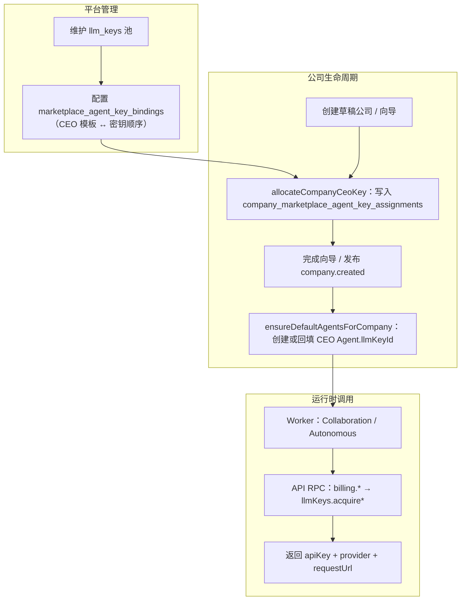
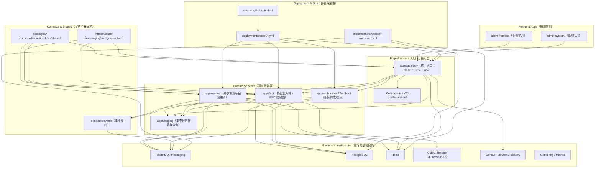

# Foundry 项目架构（端到端链路）
```mermaid
flowchart LR
  Client["Client（客户端）"] --> GWRT["Gateway runtime（网关运行时）"]

  %% ==================================================
  %% 网关：从入口到下游服务（modules + 中间件/守卫/拦截器）
  %% ==================================================
  subgraph GWMS["Gateway Nest modules（网关 Nest 模块）"]
    direction TB

    %% ConfigModule：配置模块（读取环境/配置并注入）
    Cfg["ConfigModule（配置模块）"]:::gw
    %% DatabaseModule：数据库模块（ORM/连接等）
    DB["DatabaseModule（数据库模块）"]:::gw
    %% CacheModule：缓存模块（如 Redis 等）
    Cache["CacheModule（缓存模块）"]:::gw
    %% SecurityModule：安全模块（鉴权相关组件聚合）
    Sec["SecurityModule（安全模块）"]:::gw
    %% ExceptionsModule：异常处理模块（统一错误封装）
    Ex["ExceptionsModule（异常模块）"]:::gw
    %% TracingModule：链路追踪模块（Trace/Span 相关）
    Trc["TracingModule（链路追踪模块）"]:::gw
    %% InterceptorsModule：拦截器模块（Interceptors）
    Int["InterceptorsModule（拦截器模块）"]:::gw
    %% MonitoringModule：监控模块（指标/探针等）
    Mon["MonitoringModule（监控模块）"]:::gw
    %% ResilienceModule：韧性模块（限流/熔断/降级等）
    Res["ResilienceModule（韧性模块）"]:::gw
    %% ServiceDiscoveryModule：服务发现模块
    SD["ServiceDiscoveryModule（服务发现模块）"]:::gw
    %% AuditModule：审计模块（审计日志/审计事件）
    AuditM["AuditModule（审计模块）"]:::gw
    %% HealthModule：健康检查模块
    HealthM["HealthModule（健康检查模块）"]:::gw
    %% AuthModule：认证模块（登录/鉴权支持）
    AuthM["AuthModule（认证模块）"]:::gw
    %% RoutingModule：路由模块（动态路由/转发规则）
    RoutingM["RoutingModule（路由模块）"]:::gw
    %% RpcModule：RPC 客户端模块（API/Webhooks ClientProxy）
    RpcM["RpcModule（RPC 客户端模块）"]:::gw
    %% ApiKeyModule：API Key 校验模块
    ApiKeyM["ApiKeyModule（API Key 模块）"]:::gw
    %% IpFilterModule：IP 白/黑名单过滤模块
    IpFilterM["IpFilterModule（IP 过滤模块）"]:::gw
    %% RateLimitingModule：限流模块
    RateM["RateLimitingModule（限流模块）"]:::gw
    %% CircuitBreakerModule：熔断器模块
    CircuitM["CircuitBreakerModule（熔断模块）"]:::gw
    %% CollaborationWsModule：协作实时通道（Socket.IO /collaboration）
    CollabWsM["CollaborationWsModule（协作 WebSocket）"]:::gw

    %% 各模块聚合到 Gateway runtime
    Cfg --> GWRT
    DB --> GWRT
    Cache --> GWRT
    Sec --> GWRT
    Ex --> GWRT
    Trc --> GWRT
    Int --> GWRT
    Mon --> GWRT
    Res --> GWRT
    SD --> GWRT
    AuditM --> GWRT
    HealthM --> GWRT
    AuthM --> GWRT
    RoutingM --> GWRT
    RpcM --> GWRT
    ApiKeyM --> GWRT
    IpFilterM --> GWRT
    RateM --> GWRT
    CircuitM --> GWRT
    CollabWsM --> GWRT
  end

  %% =========================
  %% 网关请求链路
  %% =========================
  %% 实时协作：Socket.IO namespace /collaboration；main.ts 可选 RedisIoAdapter 多实例；JWT 鉴权后 RPC 调 API；MQ 侧 CollaborationNotifySubscriber 推送房间通知
  CollabWsM --> CollabGw["CollaborationGateway + NotifySubscriber（WS /collaboration；可选 Redis 适配器）"]:::gw
  GWRT --> CollabGw
  CollabGw --> ApiRpc
  %% ProxyController：网关代理控制器（入口处理）
  GWRT --> Proxy["ProxyController（代理控制器）"]
  %% SignatureMiddleware：请求签名校验
  Proxy --> Sig["SignatureMiddleware（签名校验中间件）"]:::gw
  %% ReplayAttackMiddleware：防重放攻击
  Sig --> Nonce["ReplayAttackMiddleware（防重放中间件）"]:::gw
  %% CsrfProtectionMiddleware：CSRF 防护
  Nonce --> Csrf["CsrfProtectionMiddleware（CSRF 防护中间件）"]:::gw
  %% IpFilterMiddleware：IP 过滤
  Csrf --> IpF["IpFilterMiddleware（IP 过滤中间件）"]:::gw
  %% 全局 JwtAuthGuard（@Public 跳过）；拦截器顺序与 main.ts 一致：断路器启用时 CircuitBreakerInterceptor 置于最前，其余为 Logging→Timeout→Performance→Metrics→Audit→Transform
  IpF --> Jwt["JwtAuthGuard（全局 JWT；@Public 跳过）"]:::gw
  Jwt --> GInt["全局拦截器链（见 main.ts；与 ValidationPipe 并行）"]:::gw
  %% RateLimitGuard 非全局：仅部分路由（如 auth）使用 @UseGuards(RateLimitGuard)
  GInt --> Route["RoutingService（路由服务）"]:::gw
  %% DynamicRoutesService：动态路由解析 + 参数匹配（:param / :param(*) / *）
  Route --> Dyn["DynamicRoutesService（动态路由服务）"]:::gw
  %% companies routes：网关侧多为 RPC（见 routes.config）
  Route --> CompaniesRoutes["companies routes（Companies 路由配置）"]:::gw
  %% organization / agents / skills / memory / collaboration / tasks：域路由（多数走 RPC）
  Route --> OrgRoutes["organization routes（组织树/节点/审计）"]:::gw
  Route --> AgentsRoutes["agents routes（Agent CRUD/技能/审批）"]:::gw
  Route --> SkillsRoutes["skills routes（技能 CRUD）"]:::gw
  Route --> MemoryRoutes["memory routes（RAG/检索/文档摄入）"]:::gw
  Route --> CollabRoutes["collaboration routes（房间/消息/成员）"]:::gw
  Route --> TasksRoutes["tasks routes（任务/仪表盘/拆解）"]:::gw
  Route --> BillingRoutes["billing routes（账单/预算/模型路由）"]:::gw
  Route --> TemplatesRoutes["templates routes（模板预览/导入）"]:::gw
  Route --> MarketplaceRoutes["marketplace routes（Agent 商城列表/购买）"]:::gw
  %% rpcPattern whitelist：RPC pattern 白名单校验（治理）
  Route --> RpcWl["rpcPattern whitelist（RPC 白名单）"]:::gw
  %% rewritePath：重写路径
  Dyn --> Rewrite["rewritePath（路径重写）"]:::gw
  %% propagate headers：透传租户与用户头（x-company-id、x-user-info Base64 JSON，见 @service/tenant）
  Rewrite --> TenantHdr["propagate tenant headers（x-company-id / x-user-info）"]:::gw
  %% BaseProxyService：基础代理服务（将请求转发给下游）
  TenantHdr --> Proxy2["BaseProxyService（基础代理服务）"]:::gw
  %% ApiRpcProxyService：API RPC 代理
  RpcWl --> ApiRpc["ApiRpcProxyService（API RPC 代理）"]:::gw
  %% WebhooksRpcProxyService：Webhooks RPC 代理
  RpcWl --> WhRpc["WebhooksRpcProxyService（Webhooks RPC 代理）"]:::gw

  %% 下游目标：apps/api
  Proxy2 --> API_RT["apps api（应用 API 服务）"]:::svc
  %% 下游目标：apps/webhooks
  Proxy2 --> WH_RT["apps webhooks（Webhooks 服务）"]:::svc
  %% 下游目标：apps/worker（如路由表 /worker/* HTTP 转发）
  Proxy2 --> WK_RT["apps worker（Worker 服务）"]:::svc
  %% 下游目标：apps/api（通过 RPC）
  ApiRpc --> API_RT
  %% 下游目标：apps/webhooks（通过 RPC）
  WhRpc --> WH_RT

  %% =========================
  %% 网关管理端点
  %% =========================
  subgraph GWADMIN["Gateway admin endpoints（网关管理端点）"]
    direction TB
    %% routes controller：路由管理控制器
    AdminRoutes["routes controller（路由管理）"]:::admin
    %% api key controller：API Key 管理控制器
    AdminKeys["api key controller（API Key 管理）"]:::admin
    %% ip filter controller：IP 过滤管理控制器
    AdminIp["ip filter controller（IP 过滤管理）"]:::admin
    %% audit controller：审计管理控制器
    AdminAudit["audit controller（审计管理）"]:::admin
  end

  %% 管理控制器由 Gateway runtime 暴露
  GWRT --> AdminRoutes
  GWRT --> AdminKeys
  GWRT --> AdminIp
  GWRT --> AdminAudit
  %% 由对应模块提供能力
  RoutingM --> AdminRoutes
  ApiKeyM --> AdminKeys
  IpFilterM --> AdminIp
  AuditM --> AdminAudit

  %% health controller：网关健康检查控制器
  GWHealthCtrl["health controller（健康检查）"]:::gw
  %% metrics controller：网关指标控制器
  GWMetricsCtrl["metrics controller（指标）"]:::gw
  %% auth controller：网关认证相关控制器
  GWAuthCtrl["auth controller（认证）"]:::gw
  %% 将模块能力挂载到对应控制器
  HealthM --> GWHealthCtrl
  Mon --> GWMetricsCtrl
  AuthM --> GWAuthCtrl
  %% 协作 WS 依赖 JWT 与 API RPC ClientProxy
  AuthM --> CollabGw
  RpcM --> CollabGw

  %% =========================
  %% 应用 API 模块
  %% =========================
  subgraph API_MS["apps api Nest modules（应用 API Nest 模块）"]
    direction TB

    %% HTTP 中间件链（app.module configure 全路由）
    ApiEntryMw["RequestId + Logger + UserContext 中间件（TEST_AUTH 时 TestUser）"]:::svc
    ApiEntryMw --> API_RT
    %% ConfigModule：配置模块
    ApiCfg["ConfigModule（配置模块）"]:::svc
    %% CacheModule：缓存模块
    ApiCache["CacheModule（缓存模块）"]:::svc
    %% DatabaseModule：数据库模块
    ApiDB["DatabaseModule（数据库模块）"]:::svc
    %% MonitoringModule：监控模块
    ApiMon["MonitoringModule（监控模块）"]:::svc
    %% ExceptionsModule：异常处理模块
    ApiEx["ExceptionsModule（异常模块）"]:::svc
    %% SecurityModule：安全模块
    ApiSec["SecurityModule（安全模块）"]:::svc
    %% GuardsModule：鉴权守卫聚合模块
    ApiGuards["GuardsModule（守卫模块）"]:::svc
    %% TenantModule：租户上下文模块（tenant 解析 + RLS 上下文）
    ApiTenantM["TenantModule（租户模块）"]:::svc
    %% HealthModule：健康检查模块
    ApiHealthM["HealthModule（健康检查模块）"]:::svc
    %% UsersModule：用户模块
    ApiUsersM["UsersModule（用户模块）"]:::svc
    %% AuthModule：认证模块
    ApiAuthM["AuthModule（认证模块）"]:::svc
    %% OAuthModule：OAuth 模块
    ApiOAuthM["OAuthModule（OAuth 模块）"]:::svc
    %% FilesModule：文件模块
    ApiFilesM["FilesModule（文件模块）"]:::svc
    %% MessagingModule：消息/事件模块
    ApiMsgM["MessagingModule（消息模块）"]:::svc
    %% CompaniesModule：公司模块
    ApiCompaniesM["CompaniesModule（公司模块）"]:::svc
    %% OrganizationModule：组织结构模块
    ApiOrgM["OrganizationModule（组织模块）"]:::svc
    %% AgentsModule：Agent 模块
    ApiAgentsM["AgentsModule（Agents 模块）"]:::svc
    %% SkillsModule：技能模块
    ApiSkillsM["SkillsModule（Skills 模块）"]:::svc
    %% CollaborationModule：协作模块（房间/消息/成员）
    ApiCollabM["CollaborationModule（协作模块）"]:::svc
    %% MemoryModule：记忆/RAG 模块
    ApiMemoryM["MemoryModule（Memory 模块）"]:::svc
    %% TasksModule：任务与仪表盘模块
    ApiTasksM["TasksModule（Tasks 模块）"]:::svc
    %% BillingModule：计费记录/预算/模型路由 RPC
    ApiBillingM["BillingModule（计费模块）"]:::svc
    %% TemplatesModule：模板市场、模板导入、商城购买
    ApiTemplatesM["TemplatesModule（模板与商城模块）"]:::svc
    %% 各域 RpcController：MessagePattern 挂到 api-rpc-queue（与 Gateway ApiRpcProxy 对齐）
    ApiRpcCtrls["*RpcController（users/auth/oauth/files + 各域 RPC，含 billing/templates/marketplace）"]:::svc

    %% 健康检查接口：GET api health
    ApiHealthM --> ApiHealth["GET api health（健康检查）"]:::svc
    %% 文件接口：上传/下载/删除
    ApiFilesM --> FilesCtrl["files upload download delete（文件上传/下载/删除）"]:::svc
    %% 存储能力聚合（抽象层）
    ApiFilesM --> StorageM["StorageModule（存储模块）"]:::svc
    %% 存储服务：对外统一存储操作
    StorageM --> StorageSvc["StorageService（存储服务）"]:::svc
    %% 存储适配器：MinIO
    StorageM --> StorageMinio["storage minio adapter（MinIO 适配器）"]:::svc
    %% 存储适配器：S3
    StorageM --> StorageS3["storage s3 adapter（S3 适配器）"]:::svc
    %% 存储适配器：OSS
    StorageM --> StorageOss["storage oss adapter（OSS 适配器）"]:::svc
    %% 存储适配器：本地文件系统
    StorageM --> StorageLocal["storage local adapter（本地存储适配器）"]:::svc
    %% 用户接口：CRUD + 分页
    ApiUsersM --> UsersCtrl["users crud paging（用户 CRUD/分页）"]:::svc
    %% 认证接口：auth validate
    ApiAuthM --> AuthVal["auth validate（认证校验）"]:::svc
    %% OAuth 接口：绑定与账号管理
    ApiOAuthM --> OAuthCtrl["oauth bind and accounts（OAuth 绑定/账号）"]:::svc
    %% 公司接口：创建/查询/状态更新
    ApiCompaniesM --> CompaniesCtrl["companies create query status（公司创建/查询/状态）"]:::svc
    %% 组织/Agent/技能/协作/记忆/任务：经 RPC 暴露（Gateway 已配置 routes）
    ApiOrgM --> OrgRpcHint["organization.tree nodes audit（组织树/节点/审计）"]:::svc
    ApiAgentsM --> AgentsRpcHint["agents crud skills approve（Agent 生命周期）"]:::svc
    ApiSkillsM --> SkillsRpcHint["skills crud（技能管理）"]:::svc
    ApiCollabM --> CollabRpcHint["collaboration rooms messages members（协作控制面）"]:::svc
    ApiMemoryM --> MemoryRpcHint["memory search ingest summarize（记忆与文档）"]:::svc
    ApiTasksM --> TasksRpcHint["tasks dashboard breakdown logs（任务 OS）"]:::svc
    ApiBillingM --> BillingRpcHint["billing records budgets modelRouter allowance（费用与预算）"]:::svc
    ApiTemplatesM --> TemplatesRpcHint["templates preview import marketplace agents（模板与商城）"]:::svc
    ApiBillingM --> BillingPubHint["BillingService / ModelRouter publish（billing.recorded / budget.* / model.routed）"]:::svc
    ApiTemplatesM --> AgentPurchasedPubHint["AgentPurchase publish（agent.purchased）"]:::svc
    BillingPubHint --> ApiMsgM
    AgentPurchasedPubHint --> ApiMsgM
    ApiMemoryM --> ApiTaskMemL["TaskCompletedMemoryListener（task.completed → 公司记忆）"]:::svc
    %% 租户守卫：按 company 上下文校验访问
    ApiTenantM --> TenantGuard["TenantGuard（租户守卫）"]:::svc
    %% 租户服务：tenant 解析与上下文写入
    ApiTenantM --> TenantSvc["TenantService（租户服务）"]:::svc
    %% 租户上下文引导：TypeORM 会话注入 tenant + RLS
    ApiTenantM --> TenantOrmCtx["TenantTypeormContextBootstrapper（租户 ORM 上下文）"]:::svc
    %% RLS 服务：设置 Postgres tenant/company 上下文
    ApiTenantM --> TenantRlsSvc["TenantRlsService（租户 RLS 服务）"]:::svc
    %% API 发布入口：由 apps/api 触发发布（对应 MQ 中的 APIEvents）
    ApiMsgM --> APIEvents
    %% RPC 控制器挂载到 API runtime
    ApiRpcCtrls --> API_RT
    %% 鉴权守卫：JWT
    ApiGuards --> JwtApiG["JwtAuthGuard（JWT 守卫）"]:::svc
    %% 鉴权守卫：角色
    ApiGuards --> RolesG["RolesGuard（角色守卫）"]:::svc
    %% 鉴权守卫：权限
    ApiGuards --> PermG["PermissionsGuard（权限守卫）"]:::svc
    %% Tenant 模块挂载到 Users/Auth/Companies 及新域模块
    ApiTenantM --> ApiUsersM
    ApiTenantM --> ApiAuthM
    ApiTenantM --> ApiCompaniesM
    ApiTenantM --> ApiOrgM
    ApiTenantM --> ApiAgentsM
    ApiTenantM --> ApiSkillsM
    ApiTenantM --> ApiCollabM
    ApiTenantM --> ApiMemoryM
    ApiTenantM --> ApiTasksM
    ApiTenantM --> ApiBillingM
    ApiTenantM --> ApiTemplatesM
  end

  %% =========================
  %% 应用 Webhooks 模块
  %% =========================
  subgraph WH_MS["apps webhooks Nest modules（Webhooks Nest 模块）"]
    direction TB

    %% ConfigModule：配置模块
    WHCfg["ConfigModule（配置模块）"]:::svc
    %% DatabaseModule：数据库模块
    WHDB["DatabaseModule（数据库模块）"]:::svc
    %% MonitoringModule：监控模块
    WHMonM["MonitoringModule（监控模块）"]:::svc
    %% GuardsModule：鉴权守卫模块（JWT/Roles/Permissions）
    WHGuards["GuardsModule（守卫模块）"]:::svc
    %% UserContextMiddleware：用户上下文中间件（x-user-info / x-company-id）
    WHUserCtx["UserContextMiddleware（用户上下文）"]:::svc
    %% WebhooksModule：Webhooks 核心模块
    WHMod["WebhooksModule（Webhooks 模块）"]:::svc
    %% WebhooksRpcController：Webhooks RPC 控制面（CRUD/history）
    WHRpcCtrl["WebhooksRpcController（Webhooks RPC 控制器）"]:::svc

    %% 健康检查：GET health
    WHHealth["GET health（健康检查）"]:::svc
    %% 指标查询：GET metrics
    WHMetrics["GET metrics（指标）"]:::svc
    %% Webhooks 接收：POST receive
    WHRecv["POST receive（接收 Webhook）"]:::svc
    %% Webhooks 配置管理与历史：CRUD + history
    WHCfgCtrl["webhooks config crud history（配置 CRUD/历史）"]:::svc

    %% 配置/数据库/监控模块到核心模块/指标
    WHCfg --> WHMod
    WHDB --> WHMod
    WHMonM --> WHMetrics
    %% 核心模块提供接收与配置能力
    WHMod --> WHRecv
    WHMod --> WHCfgCtrl
    WHMod --> WHRpcCtrl
    %% 鉴权与上下文挂载
    WHUserCtx --> WHMod
    WHGuards --> WHMod
    %% 将控制器挂到 Webhooks runtime
    WHHealth --> WH_RT
    WHMetrics --> WH_RT
    WHRecv --> WH_RT
    WHCfgCtrl --> WH_RT
    WHRpcCtrl --> WH_RT
  end

  %% =========================
  %% RPC 消息通道（Gateway <-> API/Webhooks）
  %% =========================
  subgraph RPCMQ["RPC queues（控制面 RPC 队列）"]
    direction TB
    RQ1["api-rpc-queue"]:::mq
    RQ2["webhooks-rpc-queue"]:::mq
  end

  ApiRpc --> RQ1
  WhRpc --> RQ2
  RQ1 --> API_RT
  RQ2 --> WH_RT

  %% =========================
  %% 应用 Worker 模块与监听器
  %% =========================
  subgraph WK_MS["apps worker Nest modules（Worker Nest 模块）"]
    direction TB

    %% ConfigModule：配置模块
    WKCfg["ConfigModule（配置模块）"]:::wk
    %% IdempotencyModule：幂等（模板导入等）
    WKIdempM["IdempotencyModule（幂等模块）"]:::wk
    %% TenantModule：租户 CLS（与 API 侧一致）
    WKTenantM["TenantModule（租户模块）"]:::wk
    %% MessagingModule：消息订阅/消费模块
    WKMsg["MessagingModule（消息模块）"]:::wk
    %% MonitoringModule：监控模块
    WKMon["MonitoringModule（监控模块）"]:::wk
    %% AuthModule：认证相关业务模块
    WKAuthM["AuthModule（认证模块）"]:::wk
    %% UsersModule：用户相关业务模块
    WKUsersM["UsersModule（用户模块）"]:::wk
    %% CompaniesModule：公司相关业务模块
    WKCompaniesM["CompaniesModule（公司模块）"]:::wk
    %% OrganizationModule：组织结构变更消费
    WKOrgM["OrganizationModule（组织模块）"]:::wk
    %% AgentsModule：Agent 生命周期与 AI 运行时编排
    WKAgentsM["AgentsModule（Agents 模块）"]:::wk
    %% CollaborationModule：协作消息与群成员异步处理
    WKCollabM["CollaborationModule（协作模块）"]:::wk
    %% MemoryWorkerModule：异步文档摄入回调节点
    WKMemoryM["MemoryWorkerModule（Memory Worker）"]:::wk
    %% TasksWorkerModule：任务拆解/心跳/引入 Autonomous 编排
    WKTasksM["TasksWorkerModule（Tasks Worker）"]:::wk
    %% AutonomousModule：CEO LangGraph 自治编排（由 TasksWorker 引入）
    WKAutonomousM["AutonomousModule（LangGraph 自治编排）"]:::wk
    %% BillingWorkerModule：异步消耗入账、任务完成计费、预算信号
    WKBillingM["BillingWorkerModule（Billing Worker）"]:::wk
    %% TemplatesWorkerModule：模板导入后物化
    WKTemplatesM["TemplatesWorkerModule（Templates Worker）"]:::wk
    WKTemplatesM --> WKIdempM

    %% health controller：worker 健康检查控制器
    WHealthCtrl["health controller（健康检查）"]:::wk
    %% metrics controller：worker 指标控制器
    WMetricsCtrl["metrics controller（指标）"]:::wk

    %% 监听器：auth.login_success 事件
    L1["auth.login_success 监听器"]:::wk
    %% 监听器：auth.login_failed 事件
    L2["auth.login_failed 监听器"]:::wk
    %% 监听器：user.created 事件
    L3["user.created 监听器"]:::wk
    %% 监听器：user.updated 事件
    L4["user.updated 监听器"]:::wk
    %% 监听器：user.deleted 事件
    L5["user.deleted 监听器"]:::wk
    %% 监听器：company.created 事件
    L6["company.created 监听器"]:::wk
    %% 监听器：company.updated 事件
    L7["company.updated 监听器"]:::wk
    %% 监听器：company.status_changed 事件
    L8["company.status_changed 监听器"]:::wk
    %% 监听器：organization.structure.changed
    L9["organization.structure.changed 监听器"]:::wk
    %% 监听器：organization.node.moved（Agent 侧同步）
    L10["organization.node.moved 监听器"]:::wk
    %% 监听器：agent.*（多事件类型，统一消费）
    L11["agent.* 监听器（生命周期/技能变更）"]:::wk
    %% 监听器：collaboration.message.received
    L12["collaboration.message.received 监听器"]:::wk
    %% 监听器：collaboration.room.member joined/left
    L13["collaboration.room.member.* 监听器"]:::wk
    %% 监听器：collaboration.department.joined
    L14["collaboration.department.joined 监听器"]:::wk
    %% 监听器：memory.ingest.async.requested
    L15["memory.ingest.async.requested 监听器"]:::wk
    %% 监听器：task.breakdown.requested
    L16["task.breakdown.requested 监听器"]:::wk
    %% 监听器：task.heartbeat.tick（自治心跳；另队列同路由键见 L20）
    L17["task.heartbeat.tick 监听器（自治编排）"]:::wk
    %% 监听器：billing.consumption.requested → RPC 入账
    L18["billing.consumption.requested 监听器"]:::wk
    %% 监听器：task.completed → 发布计费请求事件
    L19["task.completed 计费监听器"]:::wk
    %% 监听器：task.heartbeat.tick → billing.signals.refresh（预算预警）
    L20["budget signals（心跳联动预算信号）"]:::wk
    %% 监听器：template.imported
    L21["template.imported 监听器"]:::wk

    %% 将业务模块能力挂载到对应监听器
    WKAuthM --> L1
    WKAuthM --> L2
    WKUsersM --> L3
    WKUsersM --> L4
    WKUsersM --> L5
    WKCompaniesM --> L6
    WKCompaniesM --> L7
    WKCompaniesM --> L8
    WKOrgM --> L9
    WKAgentsM --> L10
    WKAgentsM --> L11
    WKCollabM --> L12
    WKCollabM --> L13
    WKCollabM --> L14
    WKMemoryM --> L15
    WKTasksM --> L16
    WKTasksM --> L17
    WKTasksM --> WKAutonomousM
    WKBillingM --> L18
    WKBillingM --> L19
    WKBillingM --> L20
    WKTemplatesM --> L21
    %% 将消息模块挂载到监听器（订阅分发）
    WKMsg --> L1
    WKMsg --> L2
    WKMsg --> L3
    WKMsg --> L4
    WKMsg --> L5
    WKMsg --> L6
    WKMsg --> L7
    WKMsg --> L8
    WKMsg --> L9
    WKMsg --> L10
    WKMsg --> L11
    WKMsg --> L12
    WKMsg --> L13
    WKMsg --> L14
    WKMsg --> L15
    WKMsg --> L16
    WKMsg --> L17
    WKMsg --> L18
    WKMsg --> L19
    WKMsg --> L20
    WKMsg --> L21
    %% 将配置/监控能力挂载到控制器
    WKCfg --> WHealthCtrl
    WKCfg --> WKTenantM
    WKTenantM --> WKMsg
    WKMon --> WMetricsCtrl
    %% runtime 对控制器的挂载关系（语义图）
    WK_RT --> WHealthCtrl
    WK_RT --> WMetricsCtrl
  end

  %% =========================
  %% 合约事件与消息流转
  %% =========================
  subgraph MQ["Event messages loop（事件消息循环）"]
    direction TB

    %% contracts events：事件契约（来自 contracts/events）
    Contracts["contracts events（事件契约）"]:::mq
    %% Messaging queue：消息队列（broker）
    Q["Messaging queue（消息队列）"]:::mq

    %% 契约中的 eventType（消费端含 Worker / API 内嵌监听器）
    E1["auth.login_success"]:::mq
    E2["auth.login_failed"]:::mq
    E3["user.created"]:::mq
    E4["user.updated"]:::mq
    E5["user.deleted"]:::mq
    E6["company.created"]:::mq
    E7["company.updated"]:::mq
    E8["company.status_changed"]:::mq
    E9["organization.structure.changed"]:::mq
    E10["organization.node.moved"]:::mq
    E11["agent.*（created/updated/skills.changed/…）"]:::mq
    E12["collaboration.message.received"]:::mq
    E13["collaboration.room.member.joined/left"]:::mq
    E14["collaboration.department.joined"]:::mq
    E15["memory.ingest.async.requested"]:::mq
    E16["task.breakdown.requested"]:::mq
    E17["task.heartbeat.tick"]:::mq
    E18["template.imported"]:::mq
    E19["billing.consumption.requested"]:::mq
    E20["task.completed"]:::mq
    E21["autonomous.ceo.heartbeat.completed（Worker 发布，可审计/订阅）"]:::mq
    E22["agent.purchased（API 商城购买完成）"]:::mq
    E23["billing.recorded（API 入账成功）"]:::mq
    E24["budget.warning / budget.exceeded（API 预算预警）"]:::mq
    E25["model.routed（API 模型路由/降级）"]:::mq

    %% 队列名：来自 worker listener subscribe 配置
    QAS["auth-login-success-queue"]:::mq
    QAF["auth-login-failed-queue"]:::mq
    QUC["user-created-queue"]:::mq
    QUU["user-updated-queue"]:::mq
    QUD["user-deleted-queue"]:::mq
    QCC["company-created-queue"]:::mq
    QCU["company-updated-queue"]:::mq
    QCS["company-status-changed-queue"]:::mq
    QOS["organization-structure-changed-queue"]:::mq
    QOM["worker-organization-node-moved-agents-queue"]:::mq
    QAG["worker-agent-*-queue（按事件类型分队列）"]:::mq
    QCM["worker-collaboration-message-queue"]:::mq
    QCR["worker-collab-member-joined/left"]:::mq
    QCD["worker-collaboration-dept-joined-queue"]:::mq
    QMI["worker-memory-ingest-async"]:::mq
    QTB["worker-task-breakdown-queue"]:::mq
    QTH["worker-task-heartbeat-tick"]:::mq
    QTI["template-imported-queue"]:::mq
    QBC["worker-billing-consumption"]:::mq
    QTC["worker-task-completed-billing"]:::mq
    QTM["api-task-completed-memory"]:::mq
    QBS["worker-budget-signals-heartbeat"]:::mq

    %% apps api / worker 发布入口（经 Messaging 入队）
    APIEvents["apps api events（API 发布事件）"]:::mq
    WKPub["apps worker events（Worker 发布事件）"]:::mq

    %% 发布事件 -> 契约 -> 展开出 eventType
    APIEvents --> Contracts
    WKPub --> Contracts
    Contracts --> E1
    Contracts --> E2
    Contracts --> E3
    Contracts --> E4
    Contracts --> E5
    Contracts --> E6
    Contracts --> E7
    Contracts --> E8
    Contracts --> E9
    Contracts --> E10
    Contracts --> E11
    Contracts --> E12
    Contracts --> E13
    Contracts --> E14
    Contracts --> E15
    Contracts --> E16
    Contracts --> E17
    Contracts --> E18
    Contracts --> E19
    Contracts --> E20
    Contracts --> E21
    Contracts --> E22
    Contracts --> E23
    Contracts --> E24
    Contracts --> E25

    %% eventType -> 对应队列
    E1 --> QAS
    E2 --> QAF
    E3 --> QUC
    E4 --> QUU
    E5 --> QUD
    E6 --> QCC
    E7 --> QCU
    E8 --> QCS
    E9 --> QOS
    E10 --> QOM
    E11 --> QAG
    E12 --> QCM
    E13 --> QCR
    E14 --> QCD
    E15 --> QMI
    E16 --> QTB
    E17 --> QTH
    E18 --> QTI
    E19 --> QBC
    E20 --> QTC
    E20 --> QTM
    E17 --> QBS
    E21 --> Q
    E22 --> Q
    E23 --> Q
    E24 --> Q
    E25 --> Q

    %% broker -> 具体队列（用于订阅分发）
    Q --> QAS
    Q --> QAF
    Q --> QUC
    Q --> QUU
    Q --> QUD
    Q --> QCC
    Q --> QCU
    Q --> QCS
    Q --> QOS
    Q --> QOM
    Q --> QAG
    Q --> QCM
    Q --> QCR
    Q --> QCD
    Q --> QMI
    Q --> QTB
    Q --> QTH
    Q --> QTI
    Q --> QBC
    Q --> QTC
    Q --> QTM
    Q --> QBS

    %% 队列消费端：worker / api runtime（语义图）
    Q --> WK_RT
    Q --> API_RT
  end

  %% =========================
  %% eventType 对应到 worker 监听器
  %% =========================
  %% auth.login_success -> 对应监听器 L1
  QAS --> L1
  %% auth.login_failed -> 对应监听器 L2
  QAF --> L2
  %% user.created -> 对应监听器 L3
  QUC --> L3
  %% user.updated -> 对应监听器 L4
  QUU --> L4
  %% user.deleted -> 对应监听器 L5
  QUD --> L5
  %% company.created -> 对应监听器 L6
  QCC --> L6
  %% company.updated -> 对应监听器 L7
  QCU --> L7
  %% company.status_changed -> 对应监听器 L8
  QCS --> L8
  QOS --> L9
  QOM --> L10
  QAG --> L11
  QCM --> L12
  QCR --> L13
  QCD --> L14
  QMI --> L15
  QTB --> L16
  QTH --> L17
  QTI --> L21
  QBC --> L18
  QTC --> L19
  QBS --> L20
  QTM --> ApiTaskMemL

  %% worker 侧发布与 Messaging 订阅闭环
  WKMsg --> WKPub

  %% E22–E25：当前仓库无专用命名队列消费者；经 broker 路由键投递，供审计/通知/后续 Worker 接入

  %% =========================
  %% 应用日志模块
  %% =========================
  subgraph LOG_MS["apps logging modules（日志服务模块）"]
    direction TB

    %% ConfigModule：日志服务配置模块
    LogCfg["ConfigModule（配置模块）"]:::log
    %% LoggerModule：日志聚合/封装模块
    LogLoggerM["LoggerModule（日志模块）"]:::log
    %% LogsModule：日志领域模块
    LogLogsM["LogsModule（日志领域模块）"]:::log

    %% health controller：日志服务健康检查控制器
    LogHealthCtrl["health controller（健康检查）"]:::log
    %% LogsController：日志控制器（HTTP 入口）
    LogCtrl["LogsController（日志控制器）"]:::log

    %% LogReceiverService：日志接收服务
    LogRecvSvc["LogReceiverService（日志接收服务）"]:::log
    %% LogProcessorService：日志处理服务
    LogProcSvc["LogProcessorService（日志处理服务）"]:::log
    %% LogStorageService：日志存储服务
    LogStorageSvc["LogStorageService（日志存储服务）"]:::log
    %% LogQueryService：日志查询服务
    LogQuerySvc["LogQueryService（日志查询服务）"]:::log

    %% POST api logs：单条日志上报
    LogRecv1["POST api logs（日志上报）"]:::log
    %% POST api logs batch：批量日志上报
    LogRecv2["POST api logs batch（批量上报）"]:::log
    %% GET api logs query：日志查询
    LogQuery["GET api logs query（日志查询）"]:::log

    %% 模块/控制器依赖关系
    LogLoggerM --> LogLogsM
    LogCfg --> LogHealthCtrl
    LogLogsM --> LogCtrl
    LogCtrl --> LogRecvSvc
    LogRecvSvc --> LogProcSvc
    LogProcSvc --> LogStorageSvc
    LogCtrl --> LogQuerySvc
    LogCtrl --> LogRecv1
    LogCtrl --> LogRecv2
    LogCtrl --> LogQuery
    LogCfg --> LogLoggerM
  end

  %% 各 runtime 将日志上报到日志接收接口
  GWRT --> LogRecv1
  API_RT --> LogRecv1
  WH_RT --> LogRecv1
  WK_RT --> LogRecv1

  classDef gw fill:#f2f2f2,stroke:#666,color:#111;
  classDef svc fill:#fff7e6,stroke:#a66,color:#111;
  classDef admin fill:#e7f3ff,stroke:#36c,color:#111;
  classDef mq fill:#f3e5ff,stroke:#7a3,color:#111;
  classDef wk fill:#eaffea,stroke:#3a3,color:#111;
  classDef log fill:#f1f1ff,stroke:#55f,color:#111;
```

## LLM 密钥与 CEO Agent：平台托管设计

本节补充**与实现对齐**的端到端设计：谁配置密钥、公司创建时如何自动挂载、Worker 如何取用，以及建议的演进方向。目标读者：架构评审、后台运维与后端开发。

### 1. 设计原则与责任边界

| 角色 | 职责 | 说明 |
|------|------|------|
| **平台管理员** | 维护全局 **LLM 密钥池**（`llm_keys`）、**模型提供商**（`llm_providers`），以及在 **Marketplace** 中为 CEO 商城模板配置 **密钥绑定顺序**（`marketplace_agent_key_bindings`） | 密钥不以明文暴露给业务用户；密钥与模型名、日配额等在控制面集中治理。 |
| **系统（API）** | 在公司生命周期内创建 **`company_marketplace_agent_key_assignments`**，将「本公司 + CEO 商城模板」映射到池中的某条 `llm_key_id`；在默认 CEO Agent 上写入 **`llm_key_id` / `llm_model`** | 实现见 `AgentsBootstrapService`：`allocateCompanyCeoKey`、`ensureDefaultAgentsForCompany`。 |
| **业务用户 / 公司 Owner** | 创建公司与使用协作/群聊；**不要求**自行配置 OpenAI/Anthropic 等第三方 Key 才能使用 CEO | 若需单独为某 Agent 指定密钥，属于扩展能力，与「默认 CEO 自动挂载」主路径分离。 |
| **Worker** | 通过 **API RPC**（`llmKeys.acquire` / `llmKeys.acquireById`）在**已设置租户上下文**下取解密后的密钥与路由 URL，再构造 LangChain 模型 | **不**将业务 LLM 调用依赖为 Worker 进程环境变量；环境变量仅作开发兜底或池为空时的最后手段（见下文章节 6）。 |

**约定**：Marketplace 上默认 CEO 模板的 slug 固定为 **`ceo`**（代码层据此解析 `MarketplaceAgent`）。

### 2. 核心数据与关系

- **`llm_keys`**：全局密钥池，**无 `company_id` 列**；存加密后的 secret、provider、model_name、配额等。
- **`marketplace_agents`**：已发布的商城 Agent 定义（含 `slug`、`bound_model_name`、`skill_tags` 检索标签等）。
- **`marketplace_hire_requests`**：租户侧 **商城招聘审批**（`pending` → Owner/Admin 批准后 `purchase` 且 **必须成功发布** `agent.purchased` 才记 `completed`；发布失败则申请 `failed` 且 **不增加** 商品 `usage_count`）。另提供 RPC：`marketplace.hireRequests.*`（需 `companyId` + 租户上下文）。**直购** `POST /api/marketplace/agents/:id/purchase` 仅 **平台 `admin`/`superadmin`**，租户须走该申请流。
- **`marketplace_agent_key_bindings`**：管理员配置——某一 `marketplace_agent_id` 对应多个 `llm_key_id` 及 **sort_order**（候选顺序）。
- **`company_marketplace_agent_key_assignments`**：某公司 + 某商城模板 → **唯一分配**的一条 `assigned_llm_key_id`（并发下用唯一约束与重试挑选下一个候选）。
- **`agents`**：默认 CEO 行上 **`llm_key_id` / `llm_model`**；`metadata` 中可含 `marketplaceAgentId`、`keyAssignedFrom: 'marketplace_bindings' | 'none'` 等，便于审计与排障。

### 3. 生命周期（从管理员配置到一次对话）



**草稿阶段**：`CompaniesService` 在占位公司落库后会调用 `ensureCeoKeyAssignmentForCompany`，仅保证 **assignment** 存在，使向导内推荐等能力在 **尚未有完整组织树** 时也能按池调用 LLM（与 `AgentsBootstrapService.ensureCeoKeyAssignmentForCompany` 一致）。

**激活阶段**：`company.created` 发布后，由 API 侧监听器在租户上下文中执行 `ensureDefaultAgentsForCompany`：在 **CEO 组织节点**上创建默认 CEO Agent，或 **回填**已有 CEO 行缺失的 `llmKeyId`。

### 4. `company.created` 与 Agent 引导的衔接（实现对齐）

以下 **均在 `apps/api` 内**完成；**`apps/worker` 的 `CompanyCreatedListener` 当前仅为占位日志**，不应误认为 Worker 负责写入 CEO 或密钥分配。

| 入口 | 作用 |
|------|------|
| `CompanyCreatedCollaborationListener` | `agentsBootstrap.ensureDefaultAgentsForCompany` + 主协作房等 |
| `CompanyCreatedAgentsListener` | 幂等兜底：再次 `ensureDefaultAgentsForCompany` |
| `OrganizationInitializer` / 向导完成路径 | 组织树与 `company.created` 的编排 |

两处监听均调用同一套 bootstrap，**幂等**；代价是可能重复消费 MQ，属可优化点（见第 8 节）。

### 5. Worker 侧如何「只认 API 密钥、不认用户粘贴」

协作与自治路径统一思路：

1. **`billing.checkAllowance`**：预算门槛。
2. **`billing.modelRouter.resolve`**：结合 Agent `role`、偏好模型与任务优先级解析模型名。
3. **`agents.findOne`**：读取 **`llm_key_id`**（及 `llm_model` 等）。
4. **`llmKeys.acquireById(llmKeyId)`**（若 Agent 已绑定）或 **`llmKeys.acquire(modelName)`**（按模型从池中选可用密钥）。
5. **`CeoChatModelFactory.create(..., apiKey, providerKind, requestUrl, ...)`** 构造可调用模型。

上述封装在 Worker 中由 **`CollaborationLlmBridgeService`**、**`LlmKeyResolverService`** 与 **`AutonomousOrchestratorService`** 共享同一套「先 allowance / router，再 acquire」的语义。

### 6. 降级与兜底（与「管理员配置」的关系）

| 场景 | 行为 |
|------|------|
| 已成功 `allocateCompanyCeoKey` 且 Agent 有 **`llmKeyId`** | 优先 **`acquireById`**，与管理员分配的池条目一致。 |
| 无 assignment 或 Agent **`llmKeyId` 为空** | 退化为按 **`billing.modelRouter` 解析出的模型名**（或配置中的协作默认模型）调用 **`llmKeys.acquire(modelName)`**，仍从**全局池**选 Key，**不是**业务用户配置。 |
| 池中无可用模型 / 当日配额用尽 | RPC 失败；协作/自治记录告警并可能走静态兜底文案。 |
| **Worker 环境变量**（`OPENAI_API_KEY` 等） | 仅在 **`CeoChatModelFactory` 未拿到 RPC 返回的 `apiKey` 时**参与兜底；**产品主路径应为第 5 节 RPC 链**。本地开发可在无池环境下依赖 env。 |

### 7. 与计费、审计的衔接

- LLM 实际消耗经 **`billing.consumption.requested`** 等事件与 RPC 入账；密钥侧更新 `last_used_at` 与按日配额在 **`LlmKeysService`** 中维护。
- CEO 自动创建行带 **`metadata.systemGenerated`**、**`keyAssignedFrom`**，便于区分「商城绑定分配」与「未分配成功」。

### 8. 设计改进建议（可落地项）

1. **`company.created` 消费者合并或编排**  
   将 `CompanyCreatedCollaborationListener` 与 `CompanyCreatedAgentsListener` 合并为**单一有序管道**（或明确主消费者 + 次消费者仅处理非重叠职责），减少重复 RPC 与日志噪音，保留幂等键。

2. **Worker `CompanyCreatedListener`**  
   要么**删除/改为明确 no-op 说明**，要么改为**订阅审计类事件**（例如仅 metrics），避免运维误以为 Worker 负责 Agent 创建。

3. **可观测性**  
   对 `allocateCompanyCeoKey` 结果打指标：`assigned` / `no_marketplace_agent` / `no_bindings` / `exhausted`；对「CEO Agent `llmKeyId` 为空」比例告警，驱动管理员补绑定或扩容池。

4. **管理后台（admin-system）**  
   将「CEO 模板 + 密钥绑定顺序 + 池健康度」做成**一页检查清单**，与 `agents-bootstrap.service.spec` / E2E 场景对齐，减少线上「无 Key 可用」。

5. **文档与错误提示**  
   用户可见错误统一指向「**平台密钥池与 Marketplace 绑定**」而非「请用户自行申请 OpenAI」，与协作侧静态兜底文案一致。

---

## 仓库全景架构图（Monorepo View）


