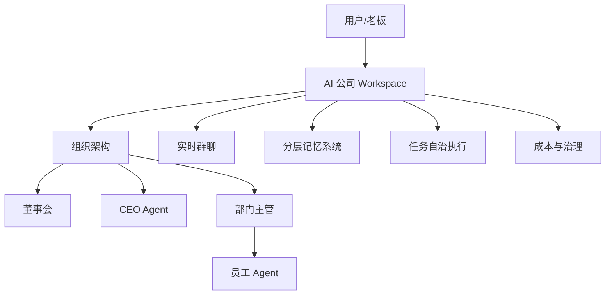
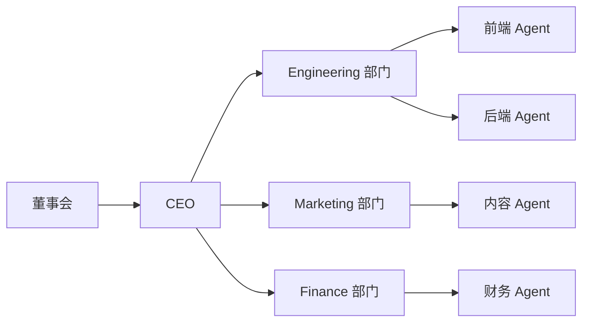
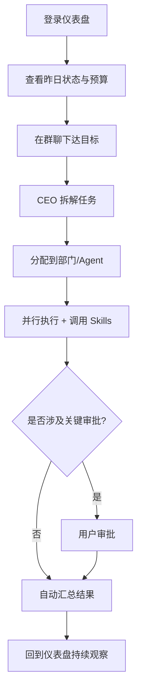
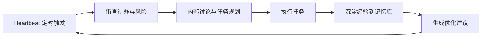
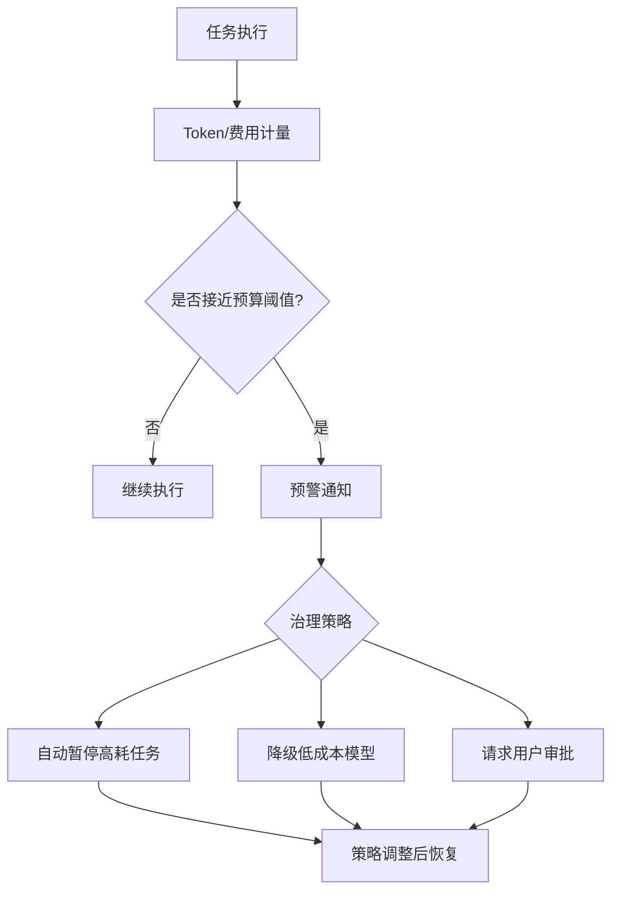
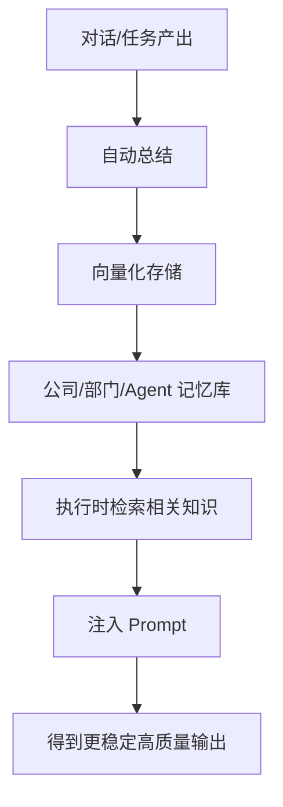

Foundry是一个云端 SaaS 平台，用户可以像新建 Notion Workspace 或 Slack Workspace 一样一键创建多个 AI 公司。每个 AI 公司拥有完整的组织架构（董事会 → CEO → 部门主管 → 员工 Agent）、实时群聊、记忆系统、任务自治执行、成本控制等能力。用户只需下达战略，AI 公司就能自主运行、主动建议、持续学习，实现“人 + AI 混合团队”的高效协作。
用户核心痛点与解决方案映射（特别详细）

一、可视化图示（便于快速观察）

1) 平台核心结构总览

2) 组织层级关系图

3) 用户日常操作路径图

4) 自治运行与 Heartbeat 闭环

5) 成本与治理监控图

6) 记忆与 RAG 工作流图

不想从零搭建公司结构
→ 一键创建公司 + 行业智能推荐默认组织结构（董事会、CEO、常见部门）。支持拖拽自定义。
不想自己管琐事，只想当老板
→ CEO Agent 作为协调中枢，定期 Heartbeat 审查待办、拆解任务、分配执行、汇总汇报。用户只需在群聊中下达指令或审批关键决策。
希望像真公司一样有层级、有分工、有会议、有汇报、有记忆
→ 完整组织结构可视化 + 动态群聊（默认用户+CEO，可随时拉部门/Agent） + 分层长期记忆（公司级/部门级/Agent 级）。
AI 要聪明主动，但重要事必须经过我（可控但自治）
→ LangGraph 分层监督器（CEO Supervisor） + Human-in-the-loop 审批流。Agent 遇到不确定事项会主动 @ 用户。
比招真实员工便宜很多，但效果接近或更好
→ 实时费用透明（每个 Agent/任务/Skill 单独计费） + 模型智能路由（CEO 用强模型，执行层用便宜模型） + 预算控制与自动暂停。
公司能越跑越好，而不是用几次就退化
→ 自动记忆写入 + RAG 检索 + 任务结束后经验总结 + 知识持续学习机制。
非技术用户也能轻松操作
→ 图形化界面（React Flow 组织图、仪表盘） + 自然语言配置 + 模板市场一键导入。

二、详细功能模块（按用户使用流程组织）
2.1 公司创建与基础管理（入口）

一键创建公司：输入公司名称 + 行业（可选），系统自动生成 slug、推荐组织结构、默认 CEO、初始预算。
多公司支持：用户可同时拥有并切换多个公司（电商公司、内容创作公司、咨询公司等）。
公司基本信息配置：名称、行业、规模、目标、初始预算、logo、描述、时区等。
公司列表与仪表盘：显示所有公司概览（进行中任务数、预算使用率、Agent 活跃度、最近活动）。
状态管理：激活、暂停、归档、软删除（重要操作需二次确认）。
成员管理入口：邀请真实人类成员（未来支持），管理公司级 RBAC 权限。

2.2 组织结构可视化与自定义

层级树可视化：董事会 → CEO → 部门主管 → 普通员工 Agent（React Flow 拖拽界面）。
默认结构智能推荐：根据行业/规模自动生成（科技公司推荐 Engineering、Product 等部门）。
自定义操作：拖拽调整汇报线、添加/删除部门/节点、修改名称/描述。
节点类型支持：Board、CEO、Department、Agent。
变更审计：每次结构调整记录前后快照。

2.3 AI 组织架构与人员配置（Agent 管理）

董事会管理：添加多个 AI 董事 Agent。
CEO 配置：自定义性格（保守/激进/创新）、决策风格、汇报习惯、System Prompt、LLM 模型。
部门与主管设置：一键添加常见部门，每个部门自动生成主管 Agent。
员工 Agent 招聘与管理：
一键/批量招聘到指定部门。
配置：角色、专长、System Prompt、可用工具/Skills、LLM 模型、性格。
模板招聘（“标准前端工程师 Agent”、“资深财务分析师”等）。

Agent 能力扩展：绑定 Skills、知识库、外部 API。
Agent 商城：购买/订阅专业预训练 Agent（含 Skills 包）。

2.4 实时协作与沟通（最日常使用场景）

动态群聊：默认主群（用户 + CEO）；支持动态拉部门/Agent/任务群。
自然对话式协作：文字 + 流式输出 + @ 提及 + 语音（未来）。
Human-in-the-loop：Agent 主动请求审批，用户在群聊中直接回复继续。
历史记录与智能总结：全文搜索、按 Agent/时间过滤、自动生成会议纪要/决策摘要。

2.5 自治运行与任务执行（长期价值核心）

Heartbeat 机制：公司每小时/每天自动审查待办、召开内部会议、分配任务、提出建议。
任务自动化：用户下达大目标 → CEO 智能拆解 → 分配给相关部门/Agent → 并行执行 → 自动汇总汇报。
进度追踪与仪表盘：公司级仪表盘（进行中项目、部门状态、预算消耗、Agent 活跃度、风险预警）。
主动性：系统能主动发现问题（如预算超支、任务延迟）并在群聊中提出建议。

2.6 记忆、知识与数据管理

公司级长期记忆：历史决策、项目文档、客户信息永久保留。
部门级/Agent 级记忆：专属知识库 + 个人上下文。
自动知识提炼：对话、任务结束后自动总结经验并向量化存储。
文件与外部集成：上传文档、连接 Google Drive/Notion/CRM，Agent 可通过 Skills 读取使用。
RAG 智能检索：Agent 执行时自动检索最相关记忆注入 Prompt。

2.7 成本、安全与治理（用户非常关心）

费用透明：实时查看每个 Agent/任务/Skill 的 Token 消耗、费用明细、趋势图。
预算控制：公司/部门/Agent 级预算上限、预警阈值、超支自动暂停或降级模型。
模型智能路由：CEO 用强模型，执行层用便宜模型，根据预算动态调整。
数据隔离与隐私：严格多租户隔离（RLS FORCE），不同公司数据永不交叉。
审计与日志：所有 Agent 决策、对话、操作、Skill 调用完整记录，可搜索追溯。
安全合规：敏感操作必须 Human-in-the-loop 审批；Skills 执行前安全校验。

2.8 扩展与高级功能

模板市场：官方 + 社区模板，一键导入完整公司（组织 + Agent + Skills + 示例任务）。
Agent 商城：购买/订阅专业 Agent 与 Skills 包。
集成与扩展：通过 Skills 连接外部 API、数据库、邮件、代码部署等。
分析与优化：公司运行报告（效率提升、瓶颈分析、AI 优化建议）。
多用户协作：邀请真实人类成员加入 AI 公司（RBAC 权限体系）。

2.9 用户体验与非功能需求

简单易用：图形化界面 + 自然语言配置，非技术用户 5 分钟上手。
实时性：群聊流式输出、进度实时推送、仪表盘实时更新。
可靠性：Agent 执行失败自动重试、任务中断可恢复、Graceful Shutdown。
移动端支持：PWA + 响应式设计，随时在手机查看状态、回复消息。
定价模式：基础免费 / 按 Agent 数量 / 按 Token 用量 / 企业版（固定额度 + 优先支持）。

三、用户使用完整旅程示例（特别详细）
用户小明（内容创作公司老板）一天的使用流程：

早上登录 → 看到公司仪表盘：昨天任务完成率 92%，预算剩余 68%，CEO 主动建议“本周内容产出可增加 20%”。
在主群聊下达指令：“帮我策划下个月的短视频营销方案”。
CEO 自动响应：拆解成 5 个子任务（市场调研、脚本创作、视觉设计、发布计划、效果预估），分配给 Marketing 部门主管 + 相关员工 Agent。
动态拉人讨论：CEO 说“我拉设计部进来”，设计部 Agent 自动进入群聊。
Agent 执行：调用 Skills（搜索趋势、生成脚本、设计工具），过程中检索历史记忆，避免重复创意。
Human-in-the-loop：涉及预算部分时 Agent @ 小明审批，小明回复“通过”。
下午查看仪表盘：实时看到任务进度、Agent 消耗、预算曲线。
晚上 Heartbeat 触发：CEO 自动总结当天工作、提出明天优化建议，推送至群聊。
查看记忆库：搜索“上个月视频数据”，系统立刻返回相关总结与文档。

整个过程小明几乎无需切换界面，只在群聊和仪表盘中操作。

四、总结：如何完美解决用户期望

像真公司一样：有层级、有分工、有会议、有汇报、有记忆。
可控但自治：AI 主动聪明，但重要决策必须经过用户。
省钱省力：远低于真实员工成本，但效果接近或更好（记忆学习 + 工具能力）。
长期可持续：公司越跑越聪明（自动总结 + RAG）。
简单易用：非技术用户也能轻松当“AI 公司老板”。